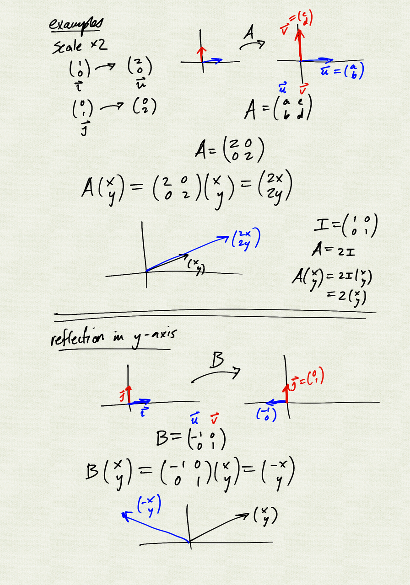

Topics:
- matrix operations
- column vectors
- linear transformations and matrix multiplication
- determinant and area
- 2D transformations: scale, reflection, rotation, projection

Reference: [OSCP 9.5, 9.7, 9.8](https://openstax.org/books/precalculus/pages/9-5-matrices-and-matrix-operations)

<iframe class="video" src="https://www.youtube.com/embed/ESZQ65u-8AU" title="YouTube video player" frameborder="0" allow="accelerometer; autoplay; clipboard-write; encrypted-media; gyroscope; picture-in-picture" allowfullscreen></iframe>

[notes (pdf)](MultiV_1.4_Matrices_Determinants.pdf)

