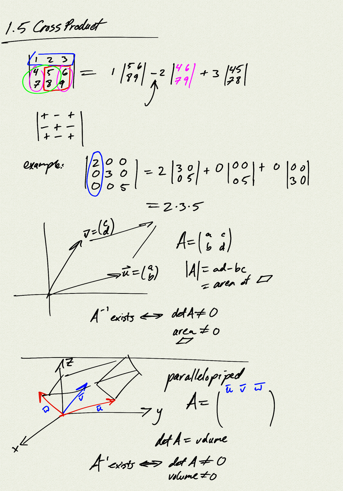
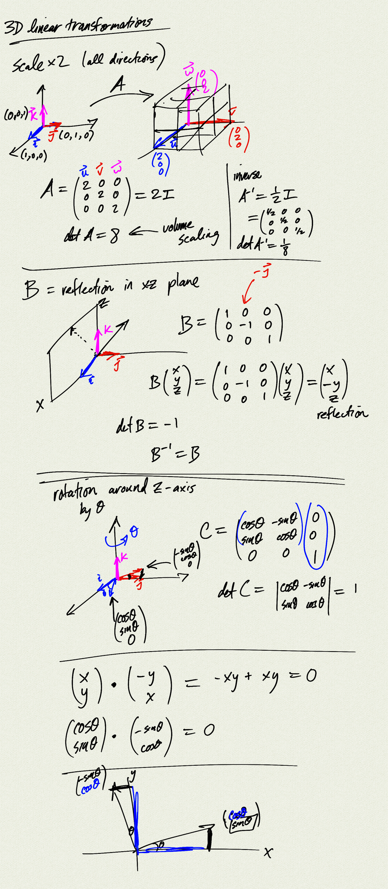
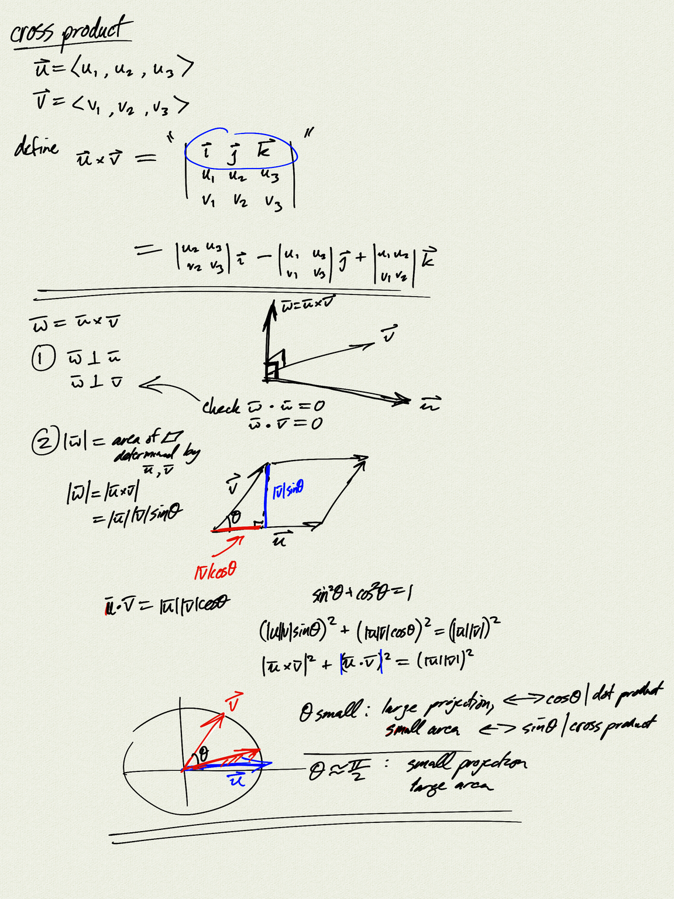
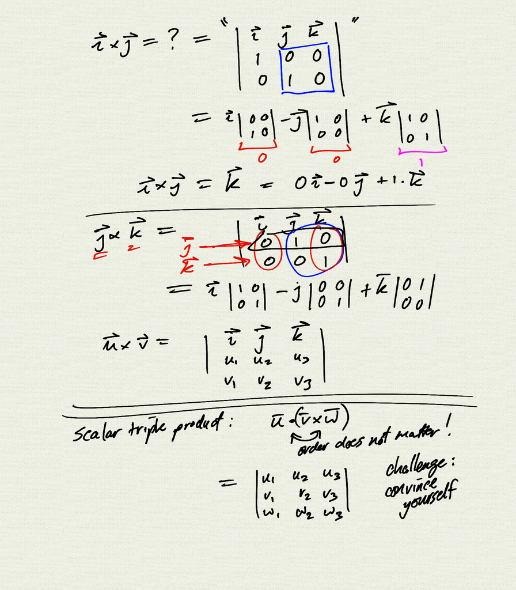

Topics:
- linear transformations in $\mathbb{R}^3$
    - determinant and volume
- cross product $\vec{w} = \vec{u} \times \vec{v}$
    - $\vec{w}$ is orthogonal to $\vec{u}$ and $\vec{v}$
    - $\|\vec{w}\|$ = $\|\vec{u}\|\|\vec{v}\|\sin\theta$ = area of parallelogram
    - right hand rule
- scalar triple product
- $ \|\vec{u} \cdot \vec{v}\|^2 + \|\vec{u} \times \vec{v}\|^2 = \|\vec{u}\|^2 \|\vec{v}\|^2 $

Reference: [OSC 2.4 Cross Product](https://openstax.org/books/calculus-volume-3/pages/2-4-the-cross-product)

[notes (pdf)](MultiV_1.5_CrossProduct.pdf)

<iframe class="video" src="https://www.youtube.com/embed/FSSlkyCPi7I" title="YouTube video player" frameborder="0" allow="accelerometer; autoplay; clipboard-write; encrypted-media; gyroscope; picture-in-picture" allowfullscreen></iframe>
