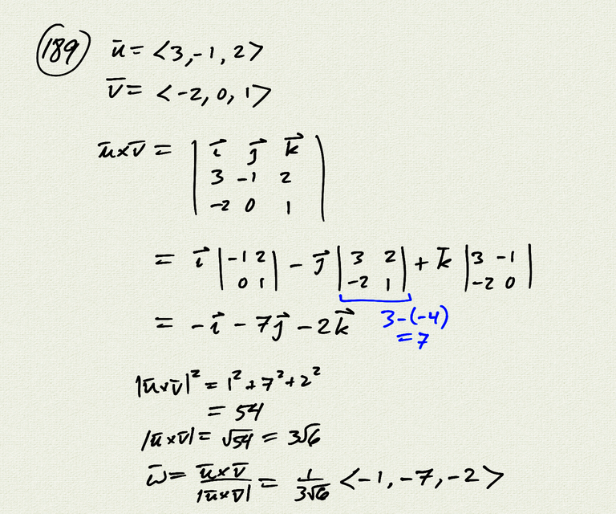
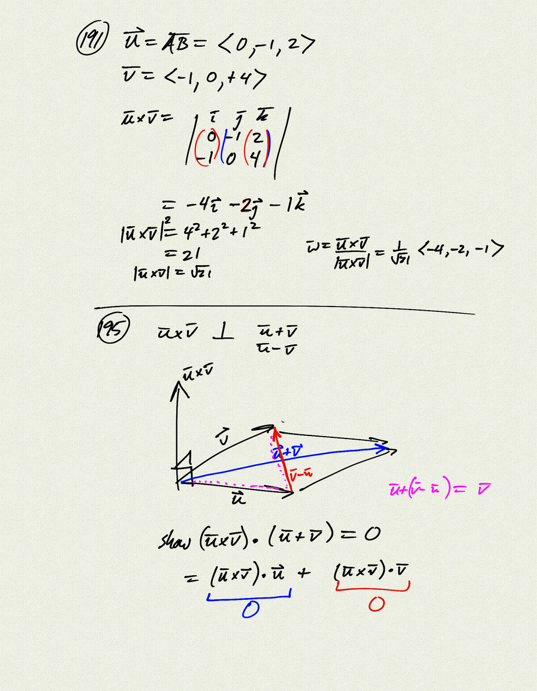
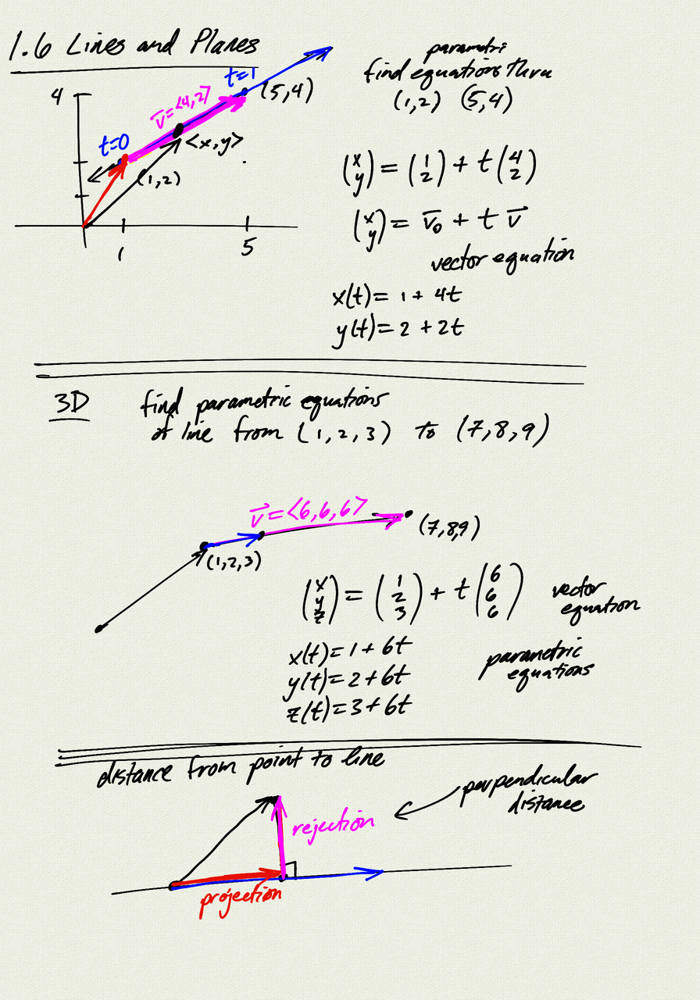
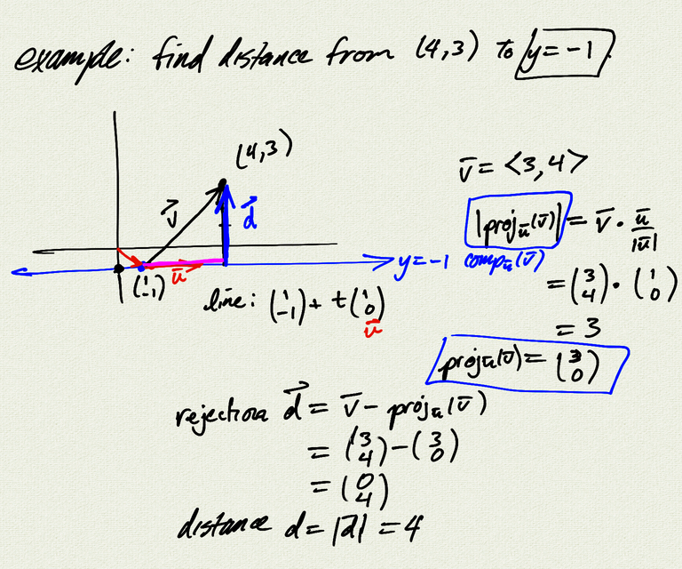
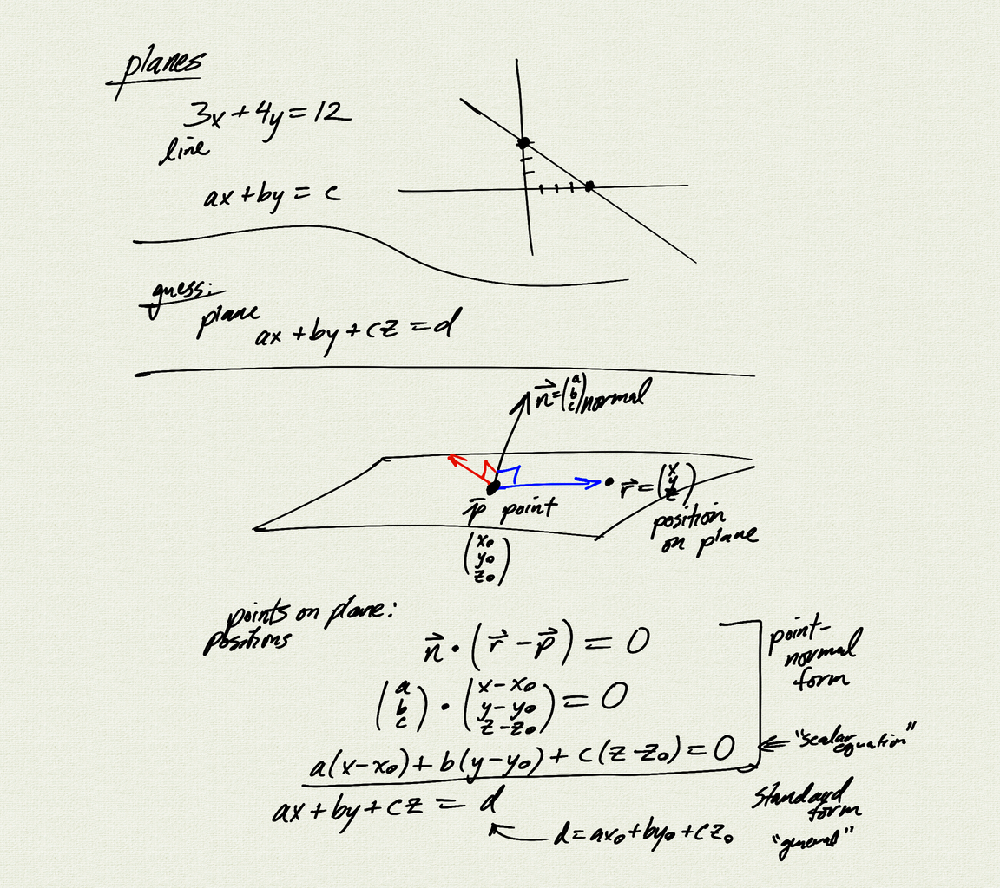
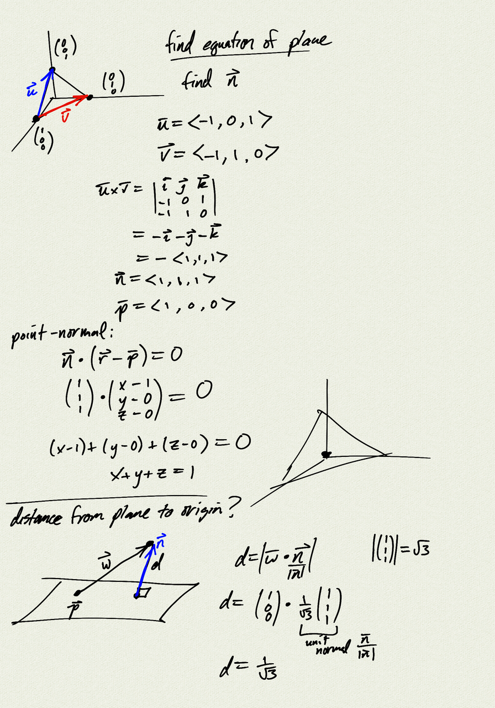

Topics:
- parametric equations of lines
- distance from point to line
- equations of planes
- distance from point to plane

Reference: [OSC3 2.5](https://openstax.org/books/calculus-volume-3/pages/2-5-equations-of-lines-and-planes-in-space)

[notes (pdf)](MultiV_1.6_Lines_Planes.pdf)

<iframe class="video" src="https://www.youtube.com/embed/kE6NF-kVAvA" title="YouTube video player" frameborder="0" allow="accelerometer; autoplay; clipboard-write; encrypted-media; gyroscope; picture-in-picture" allowfullscreen></iframe>

