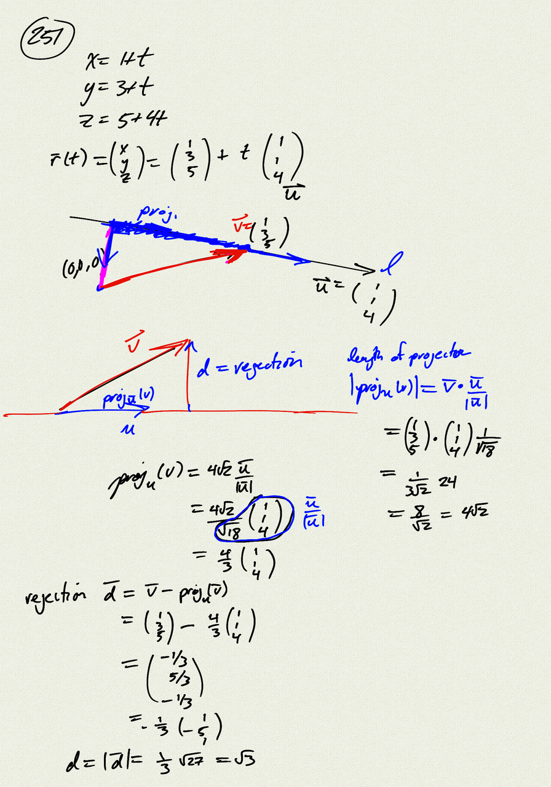
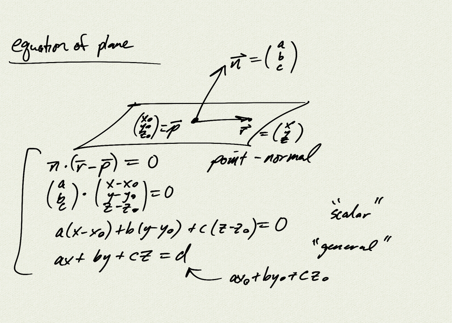
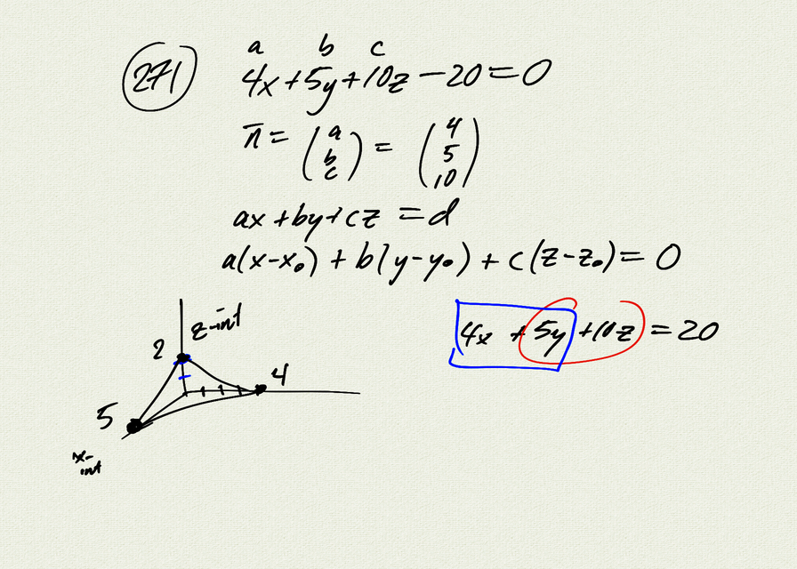
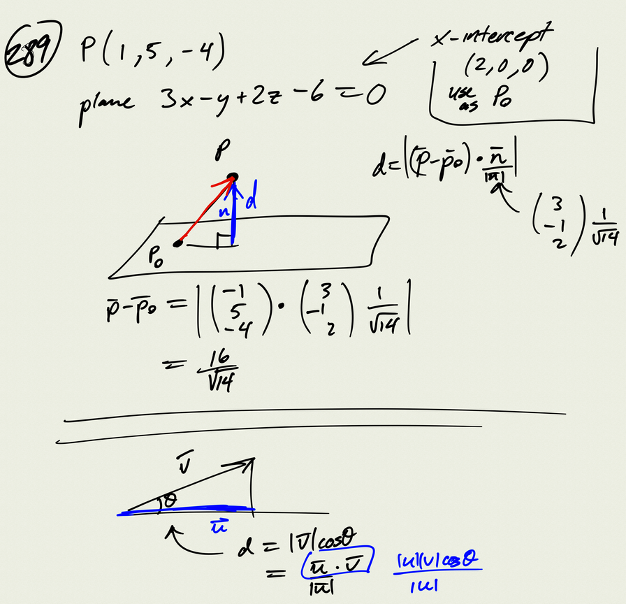
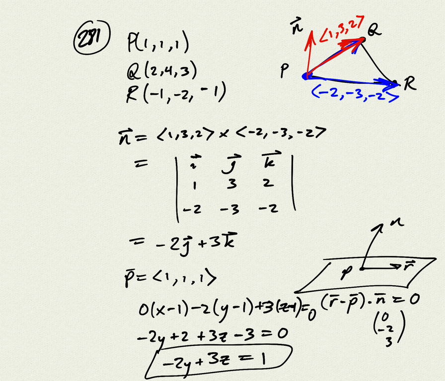
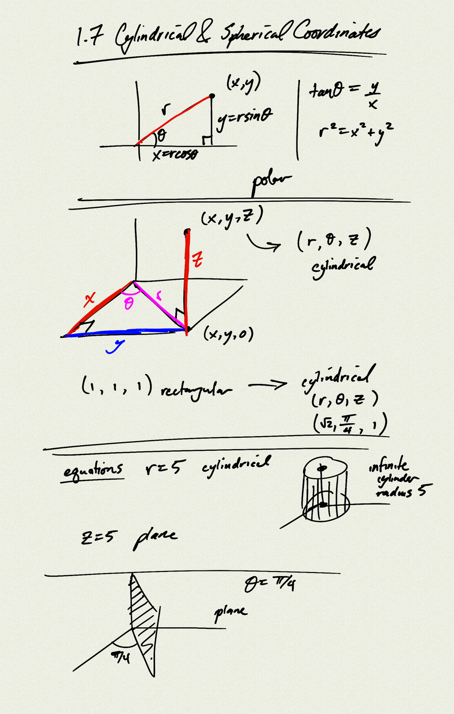
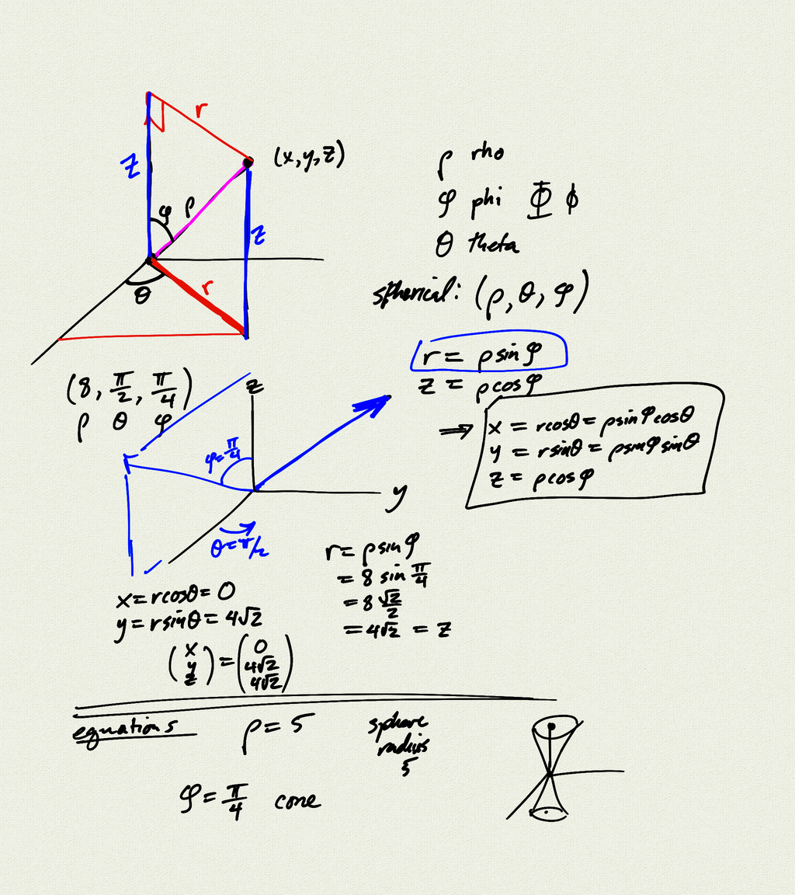

Topics:
- cylindrical coordinates
- spherical coordinates

Reference: [OSC3 2.7](https://openstax.org/books/calculus-volume-3/pages/2-7-cylindrical-and-spherical-coordinates)

[notes (pdf)](MultiV_1.7_CylindricalSpherical.pdf)

<iframe class="video" src="https://www.youtube.com/embed/eQzzUdg5t6A" title="YouTube video player" frameborder="0" allow="accelerometer; autoplay; clipboard-write; encrypted-media; gyroscope; picture-in-picture" allowfullscreen></iframe>

