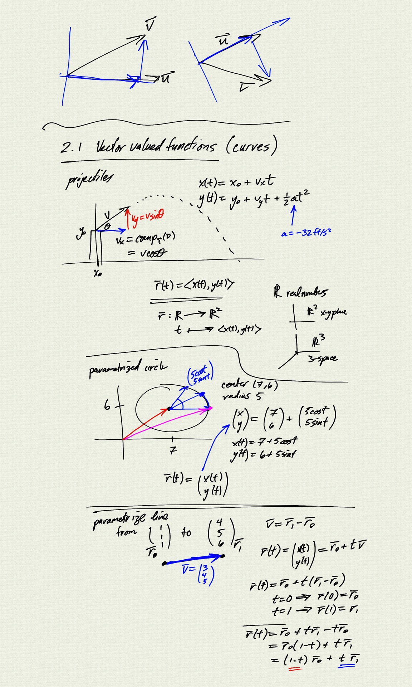
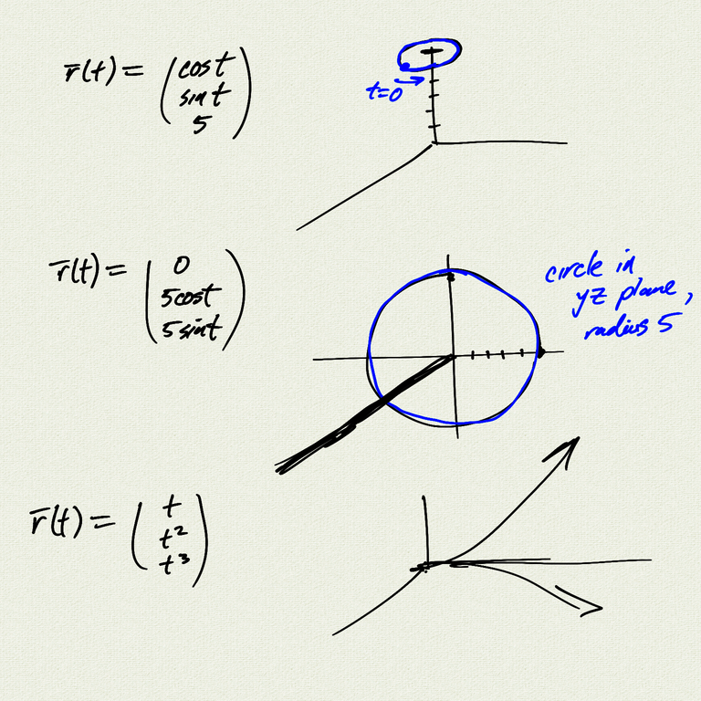
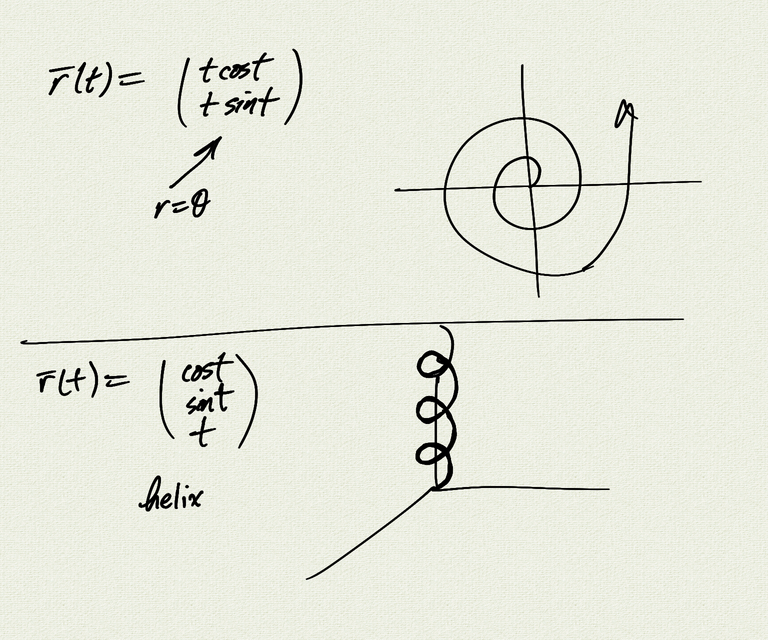

Topics:
- parametric equations
- vector valued functions (curves)

Reference: [OSC3 3.1](https://openstax.org/books/calculus-volume-3/pages/3-1-vector-valued-functions-and-space-curves)

[notes (pdf)](MultiV_2.1_VectorValuedFunctions.pdf)

<iframe class="video" src="https://www.youtube.com/embed/EJK5aTm_p6s" title="YouTube video player" frameborder="0" allow="accelerometer; autoplay; clipboard-write; encrypted-media; gyroscope; picture-in-picture" allowfullscreen></iframe>

