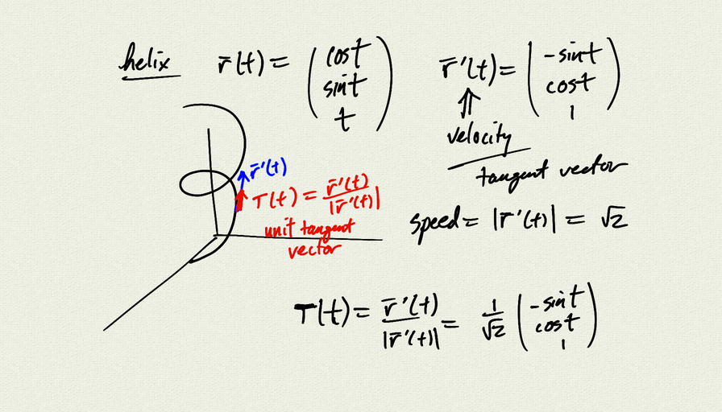

Topics:
- derivatives of vector valued functions
- tangent vectors of curves

Reference: [OSC3 3.2](https://openstax.org/books/calculus-volume-3/pages/3-2-calculus-of-vector-valued-functions)

[notes (pdf)](MultiV_2.2_CalculusVectorValued.pdf)

<iframe class="video" src="https://www.youtube.com/embed/tAaHd7owTHA" title="YouTube video player" frameborder="0" allow="accelerometer; autoplay; clipboard-write; encrypted-media; gyroscope; picture-in-picture" allowfullscreen></iframe>

