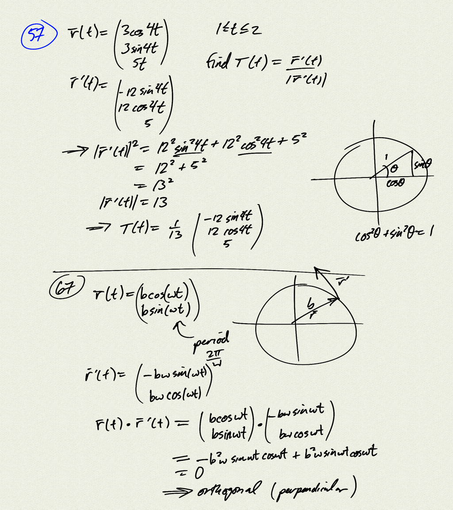
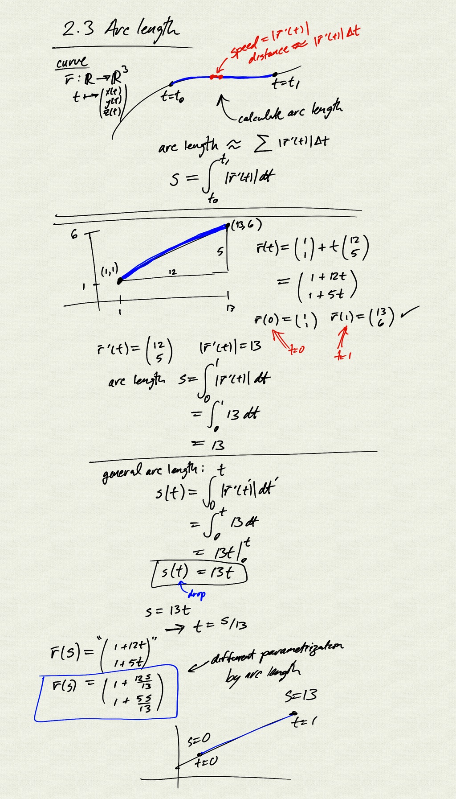
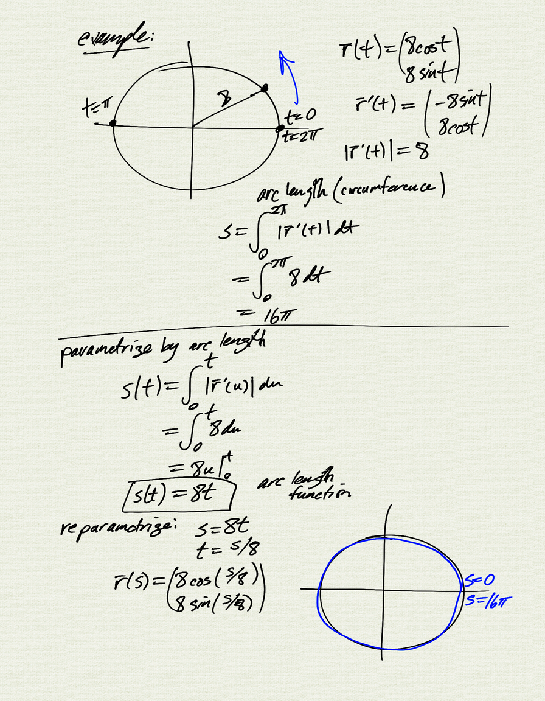
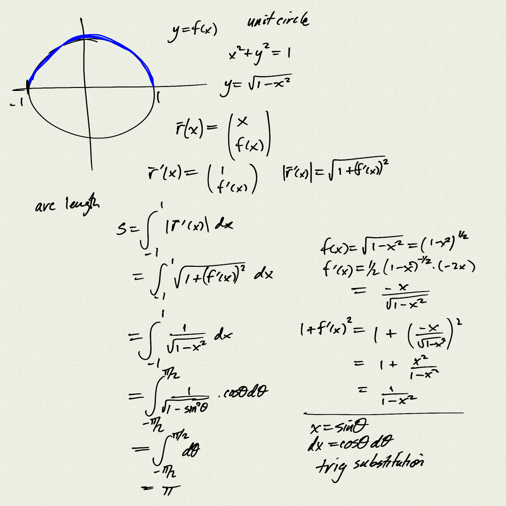

Topics:
- arc length
- parametrization by arc length

Reference: [OSC3 3.3](https://openstax.org/books/calculus-volume-3/pages/3-3-arc-length-and-curvature)

[notes (pdf)](MultiV_2.3_ArcLength.pdf)

<iframe class="video" src="https://www.youtube.com/embed/EC1PgxKHInE" title="YouTube video player" frameborder="0" allow="accelerometer; autoplay; clipboard-write; encrypted-media; gyroscope; picture-in-picture" allowfullscreen></iframe>

