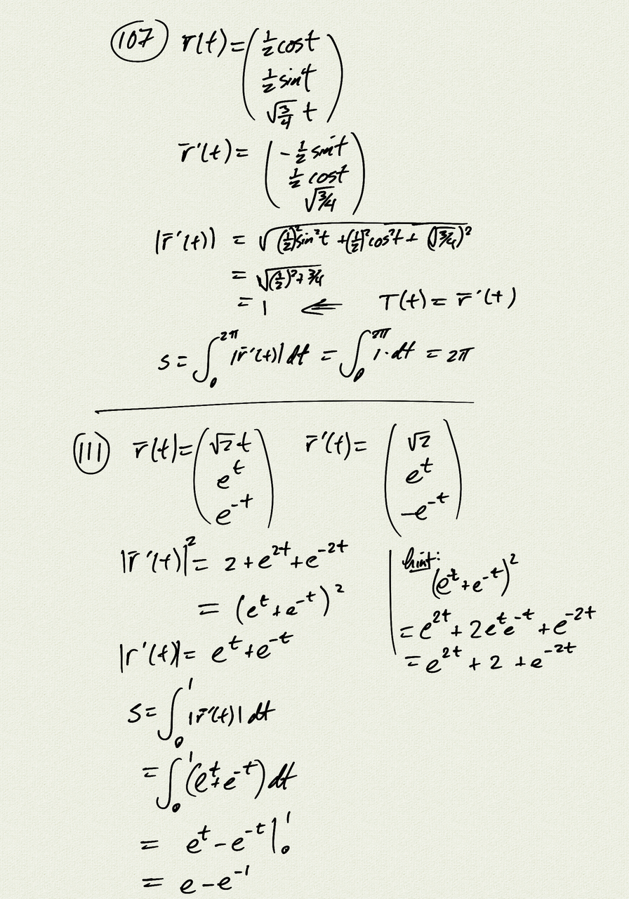
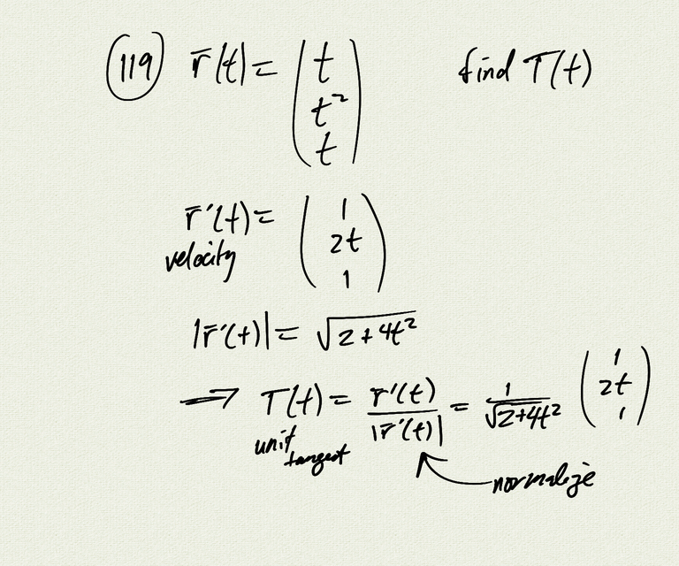
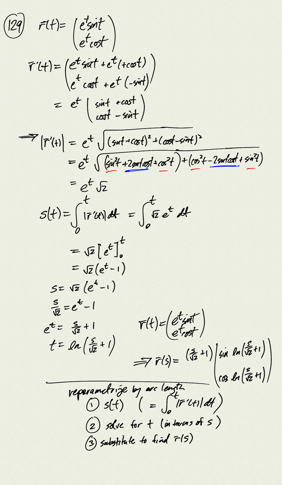
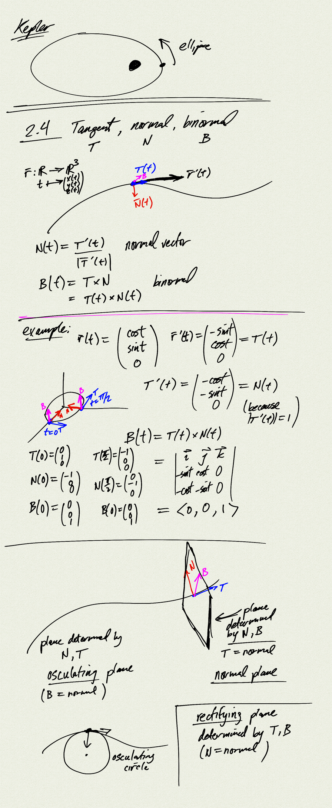
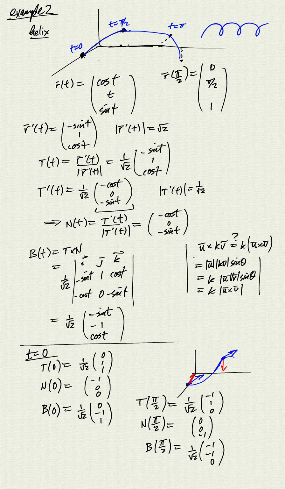

Topics:
- tangent, normal, and binormal unit vectors
- normal, osculating, and rectifying planes

Reference: [OSC3 3.3](https://openstax.org/books/calculus-volume-3/pages/3-3-arc-length-and-curvature)

[notes (pdf)](MultiV_2.4_TangentNormalBinormal.pdf)

<iframe class="video" src="https://www.youtube.com/embed/h5qhcHHnU6o" title="YouTube video player" frameborder="0" allow="accelerometer; autoplay; clipboard-write; encrypted-media; gyroscope; picture-in-picture" allowfullscreen></iframe>

