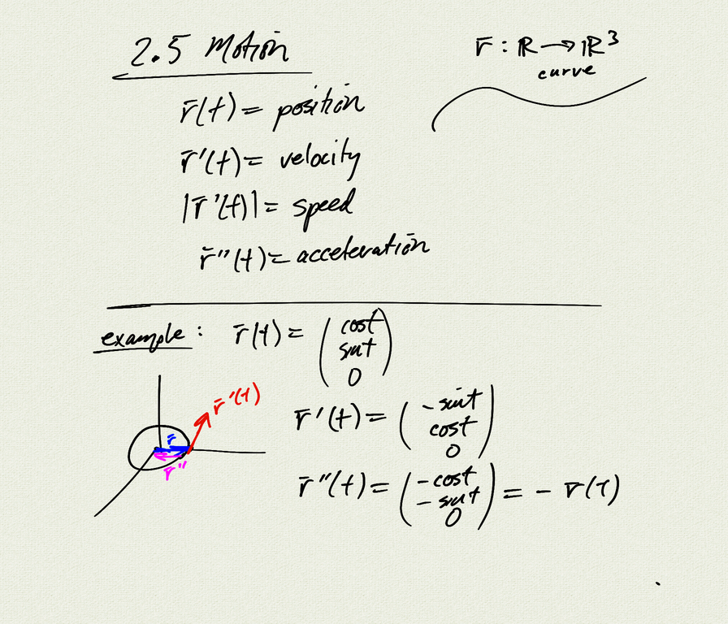

Topics:
- $\|\vec{r}(t)\|=1 \quad\Rightarrow\quad \vec{r}\perp\vec{r}\, \'$ 
- $T \perp N$
- position, velocity, acceleration
- projectile motion
- conic sections:
    - parabola
    - ellipse
    - hyperbola

Reference: [OSC3 3.4](https://openstax.org/books/calculus-volume-3/pages/3-4-motion-in-space)

[notes (pdf)](MultiV_2.5_Motion_Conics.pdf)

<iframe class="video" src="https://www.youtube.com/embed/RtOa7FIEu50" title="YouTube video player" frameborder="0" allow="accelerometer; autoplay; clipboard-write; encrypted-media; gyroscope; picture-in-picture" allowfullscreen></iframe>

