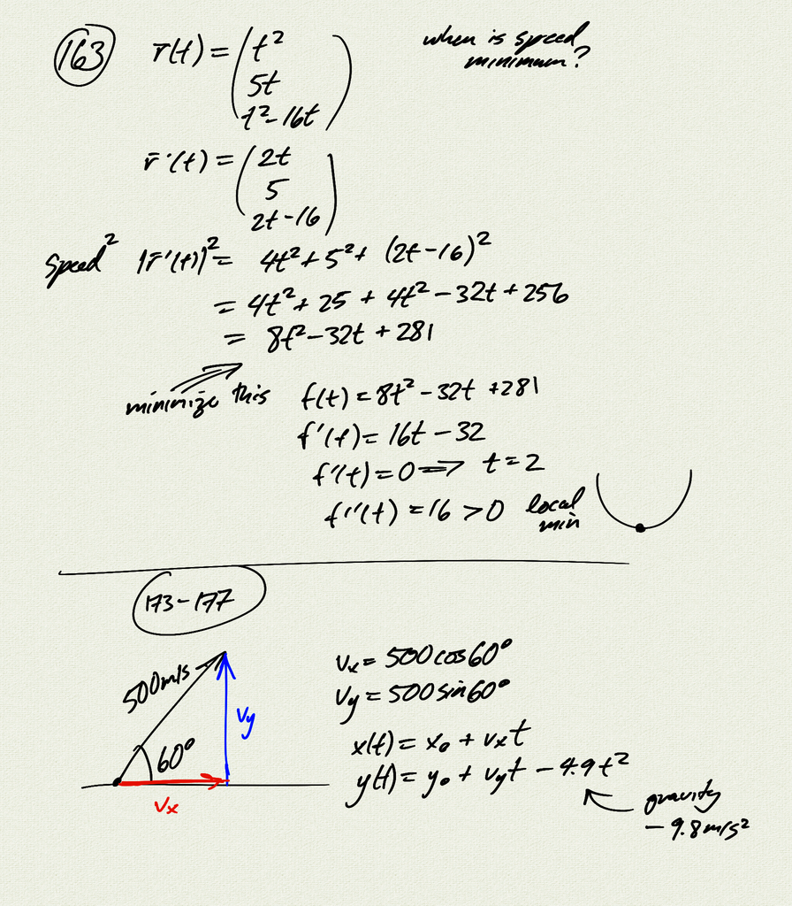
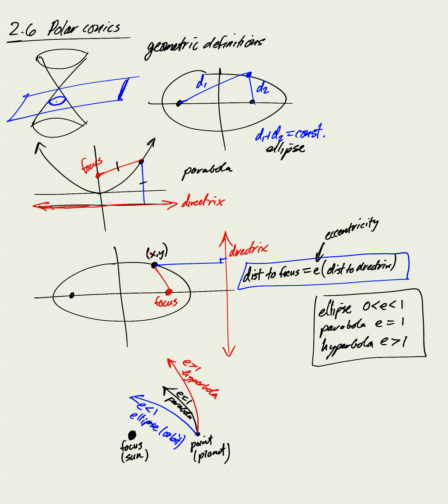
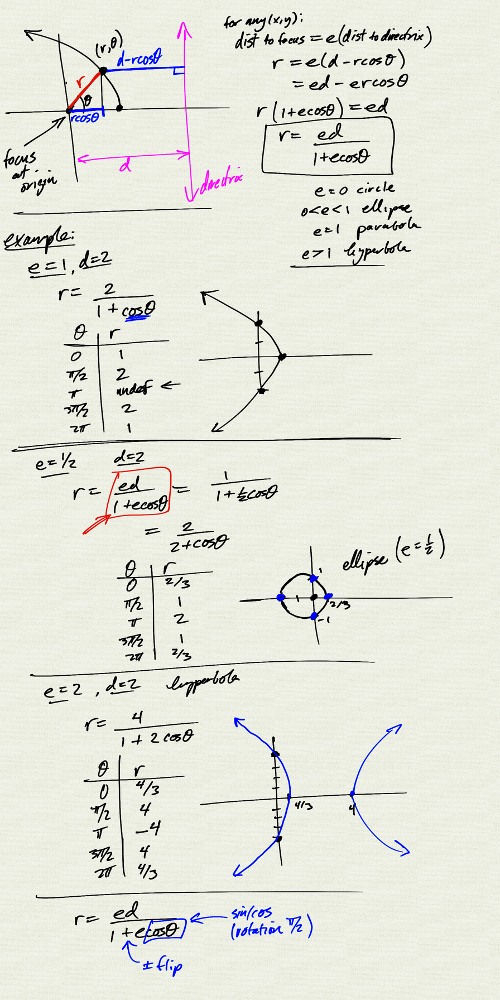

Topics:
- geometric definitions of conic sections
- eccentricity
- polar equations of conic sections

Reference: [OSC3 1.5](https://openstax.org/books/calculus-volume-3/pages/1-5-conic-sections)

[notes (pdf)](MultiV_2.6_PolarConics.pdf)

<iframe class="video" src="https://www.youtube.com/embed/eJRO-Yu8f9Y" title="YouTube video player" frameborder="0" allow="accelerometer; autoplay; clipboard-write; encrypted-media; gyroscope; picture-in-picture" allowfullscreen></iframe>
