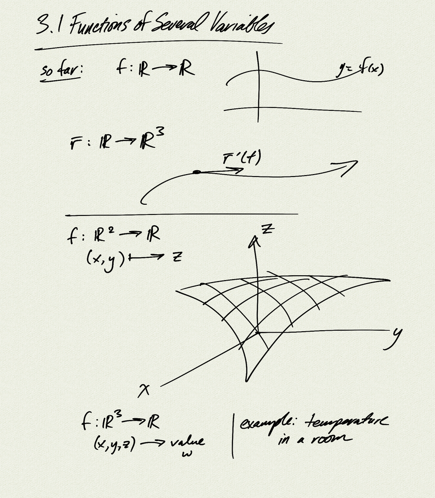

Topics:
- functions of several variables
- level sets

Reference: [OSC3 4.1](https://openstax.org/books/calculus-volume-3/pages/4-1-functions-of-several-variables)

[notes (pdf)](MultiV_3.1_FunctionsSeveralVariables.pdf)

<iframe class="video" src="https://www.youtube.com/embed/SVsjp6oSDD8" title="YouTube video player" frameborder="0" allow="accelerometer; autoplay; clipboard-write; encrypted-media; gyroscope; picture-in-picture" allowfullscreen></iframe>

