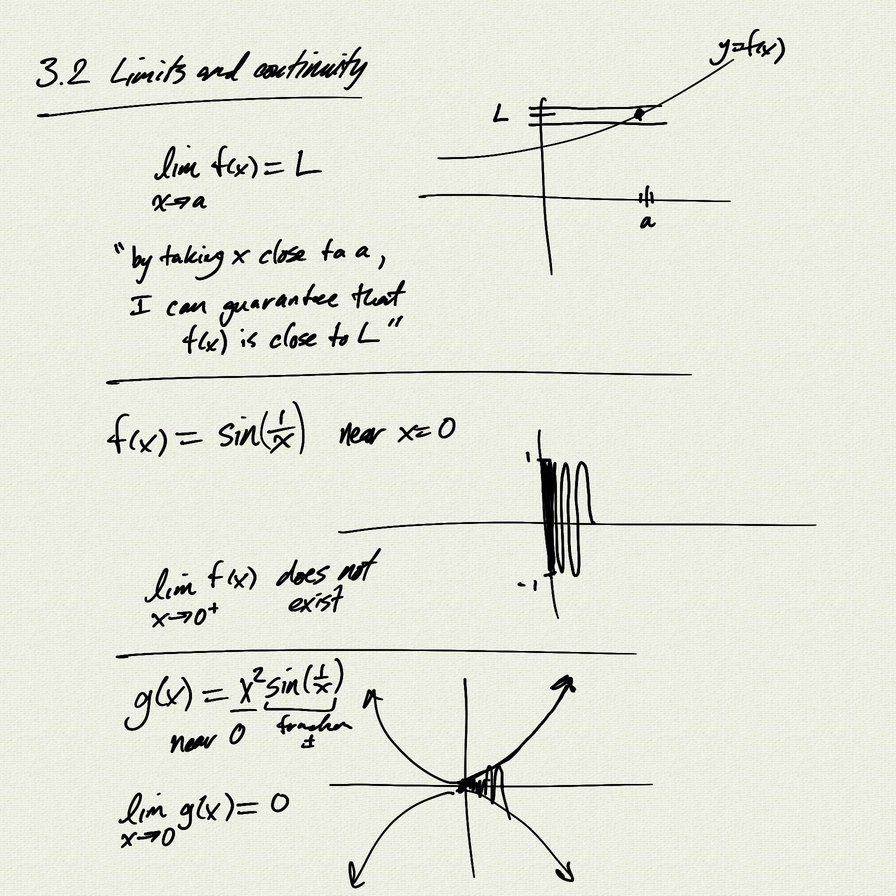
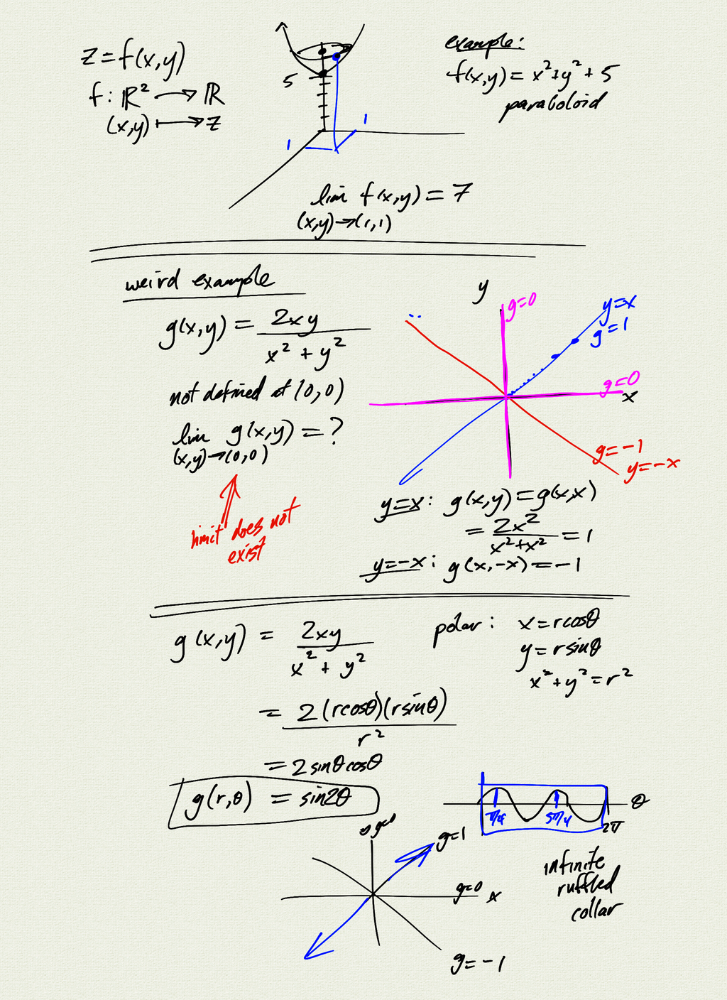

Topics:
- limits and continuity

Reference: [OSC3 4.2](https://openstax.org/books/calculus-volume-3/pages/4-2-limits-and-continuity)

[notes (pdf)](MultiV_3.2_LimitsContinuity.pdf)

<iframe class="video" src="https://www.youtube.com/embed/nuyxxN2Wy48" title="YouTube video player" frameborder="0" allow="accelerometer; autoplay; clipboard-write; encrypted-media; gyroscope; picture-in-picture" allowfullscreen></iframe>

