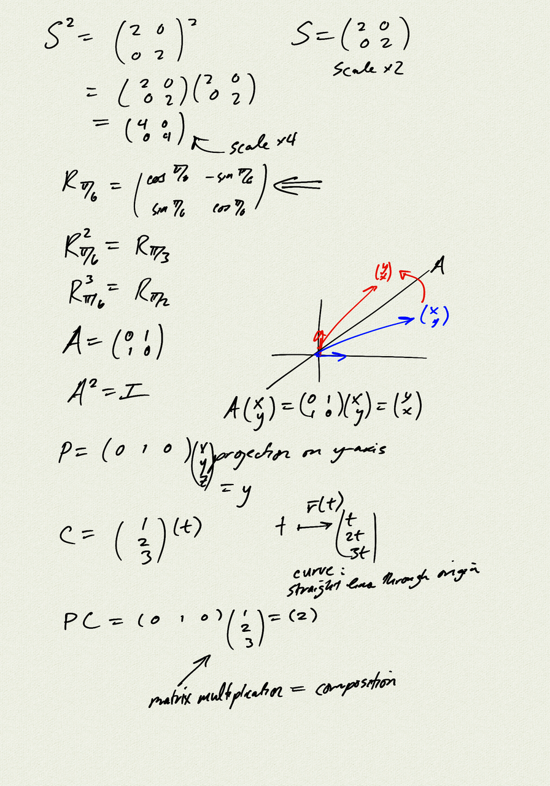
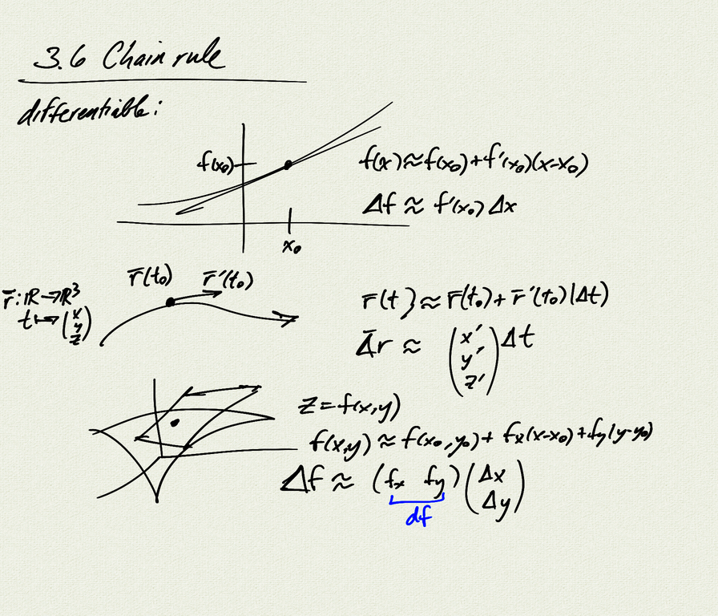
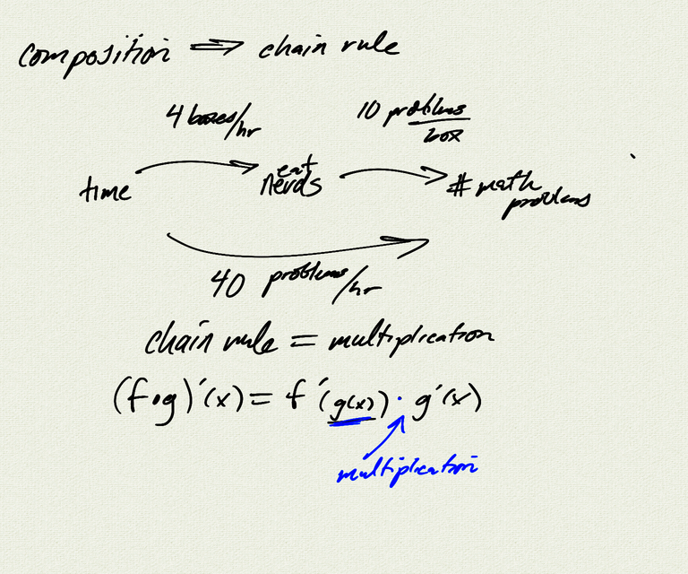
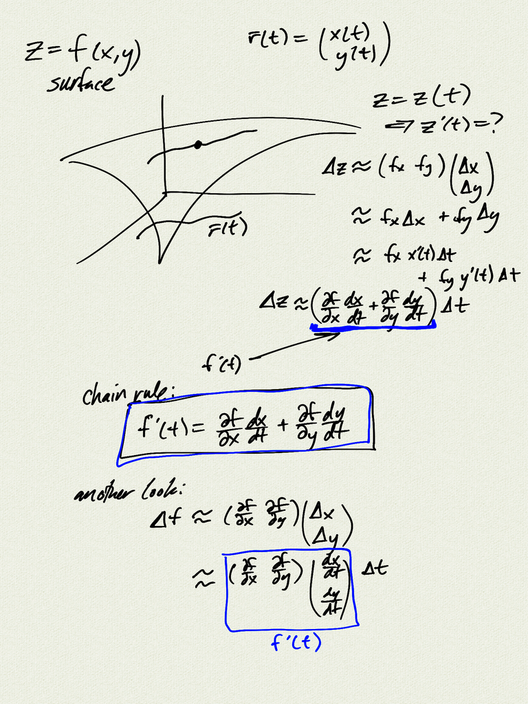
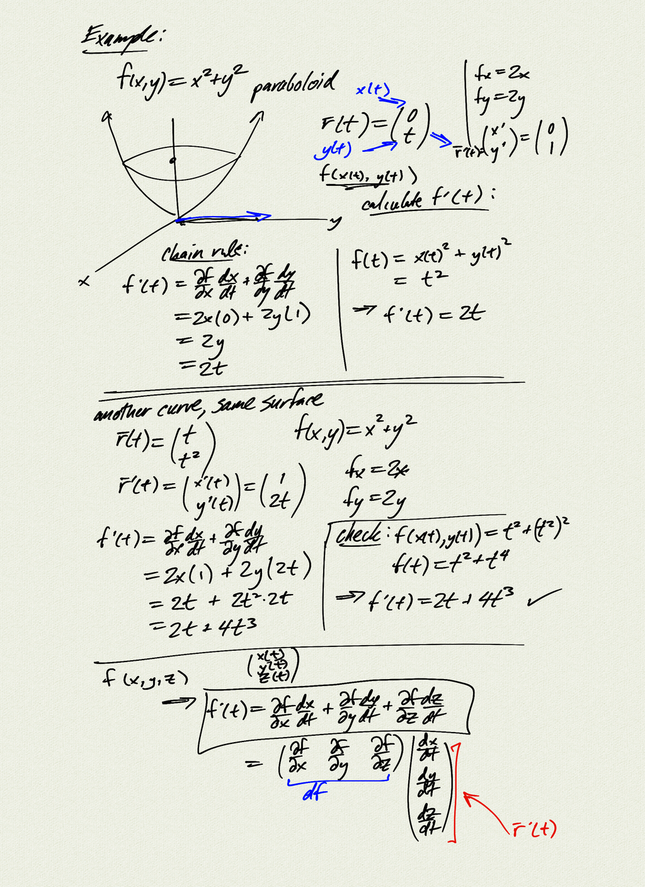
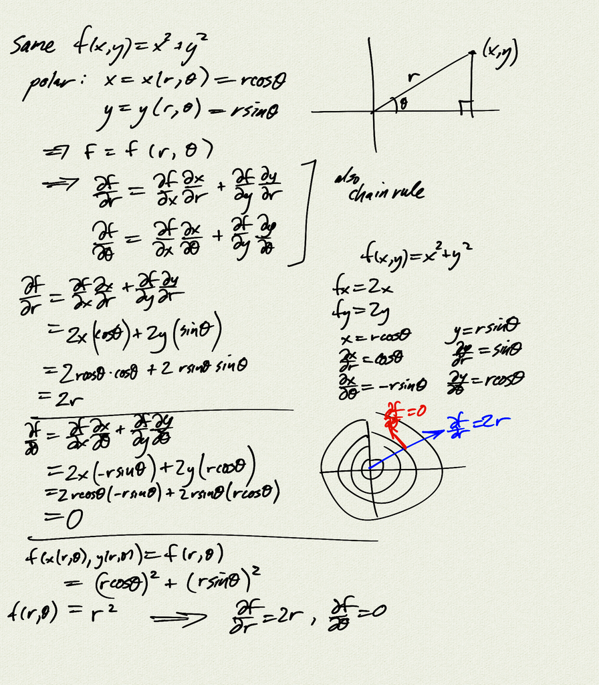

Topics:
- chain rule
    - composition of derivatives is matrix multiplication

[notes (pdf)](MultiV_3.6_ChainRule.pdf)

<iframe class="video" src="https://www.youtube.com/embed/7zr4VbCknfw" title="YouTube video player" frameborder="0" allow="accelerometer; autoplay; clipboard-write; encrypted-media; gyroscope; picture-in-picture" allowfullscreen></iframe>

