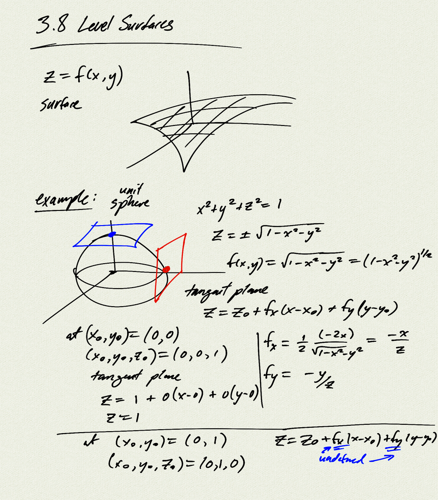
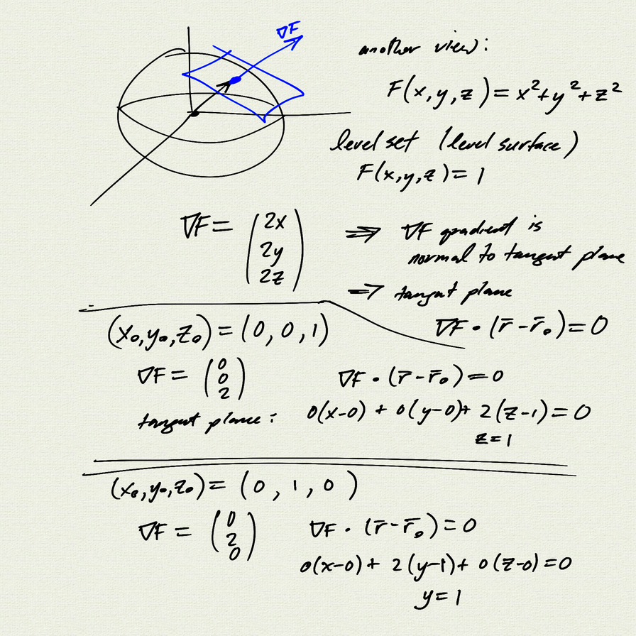
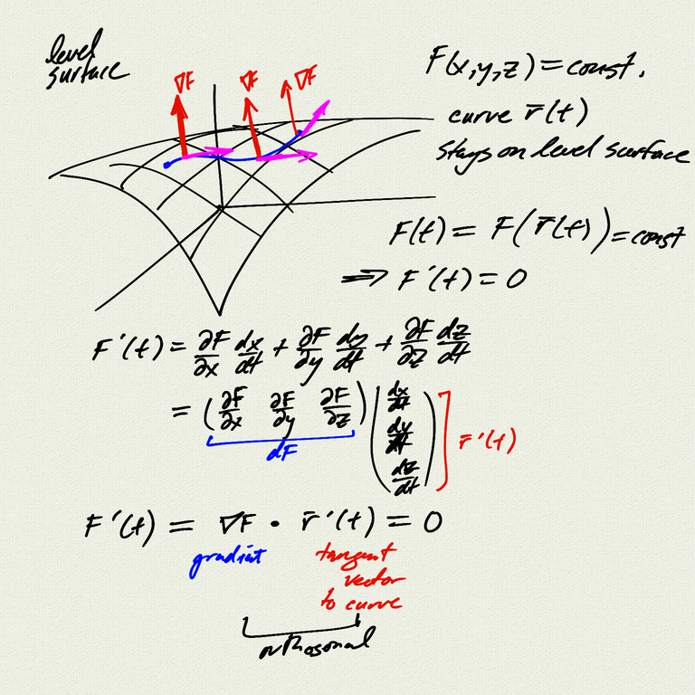

Topics:
- level surfaces
    - $F(x,y,z) = \text{const}$
- tangent plane
    - $\nabla F \cdot (\vec{r} - \vec{r_0}) = 0$

[homework](homework)  
[homework (pdf)](homework.pdf)  

[notes (pdf)](MultiV_3.8_LevelSurfaces.pdf)

<iframe class="video" src="https://www.youtube.com/embed/K4Il4ZrXIns" title="YouTube video player" frameborder="0" allow="accelerometer; autoplay; clipboard-write; encrypted-media; gyroscope; picture-in-picture" allowfullscreen></iframe>

