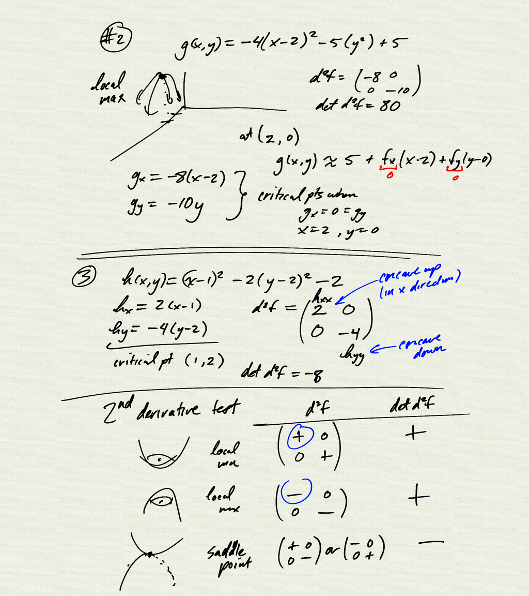
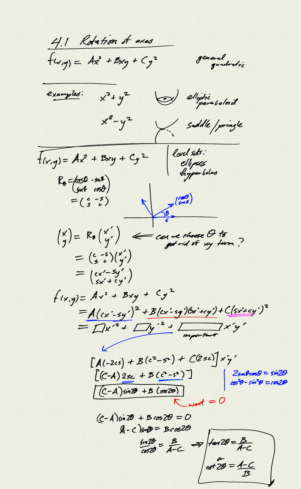
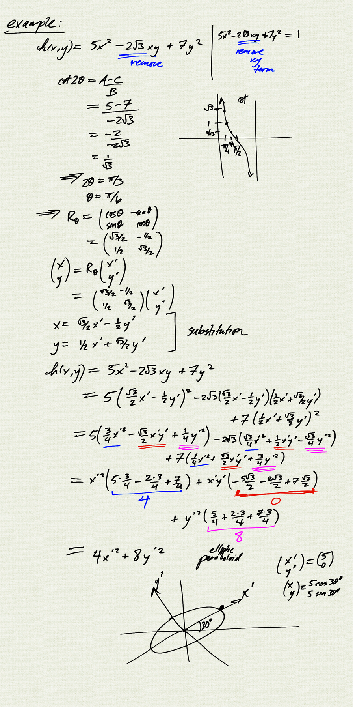
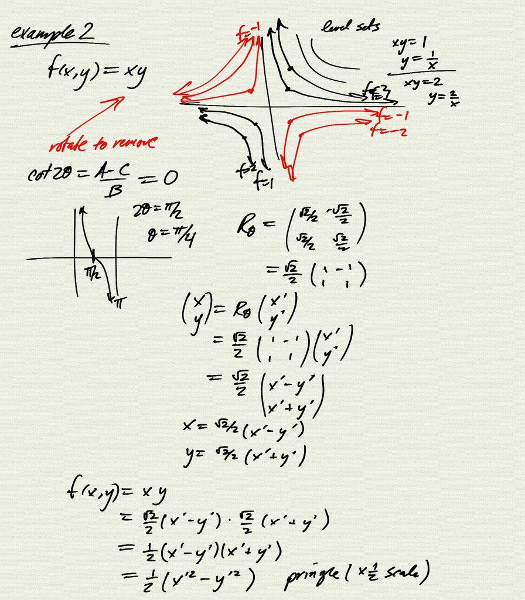

Topics:
- rotation of axes to remove $xy$ term in general quadratics
    $f(x,y) = Ax^2 + Bxy + Cy^2$

[notes (pdf)](MultiV_4.1_RotationOfAxes.pdf)

<iframe width="560" height="315" src="https://www.youtube.com/embed/E1od8oy0rZw" title="YouTube video player" frameborder="0" allow="accelerometer; autoplay; clipboard-write; encrypted-media; gyroscope; picture-in-picture" allowfullscreen></iframe>

