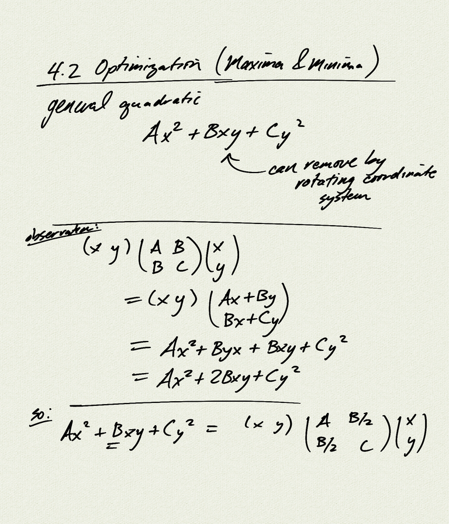
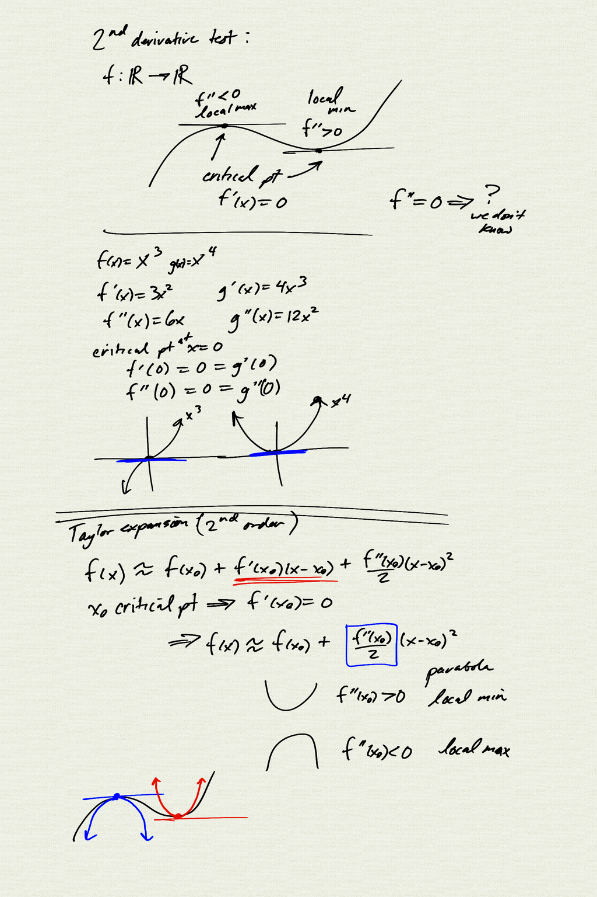
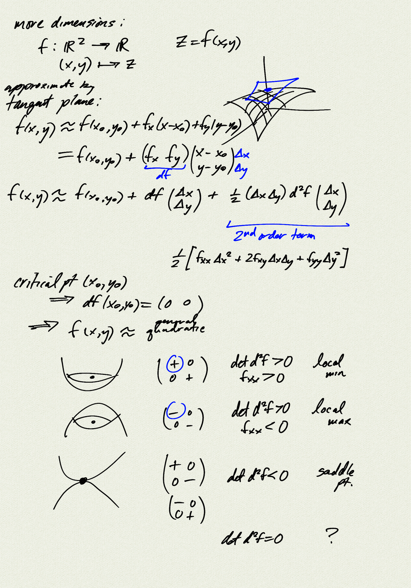
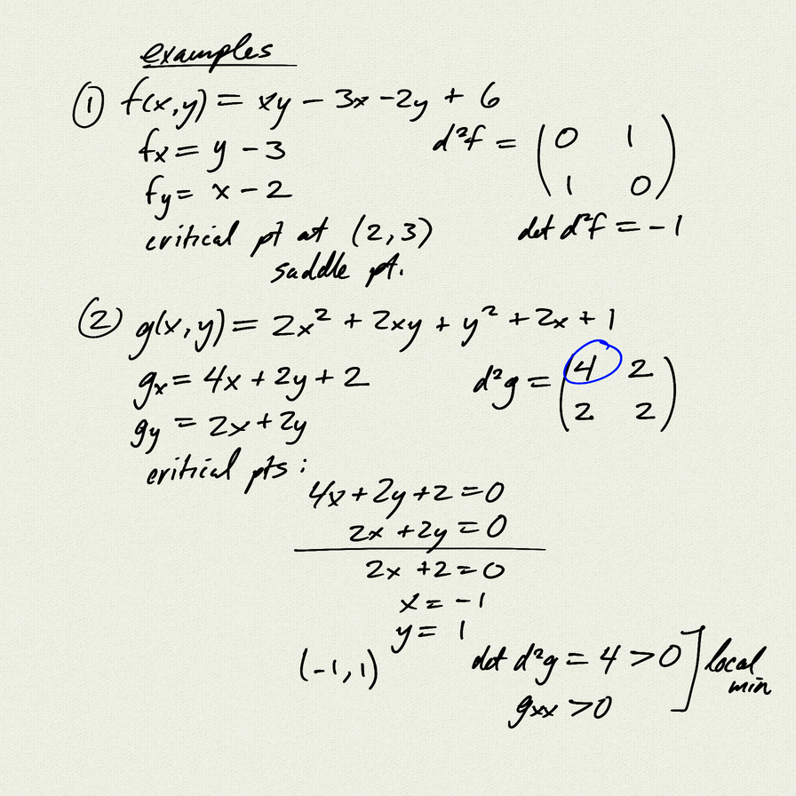
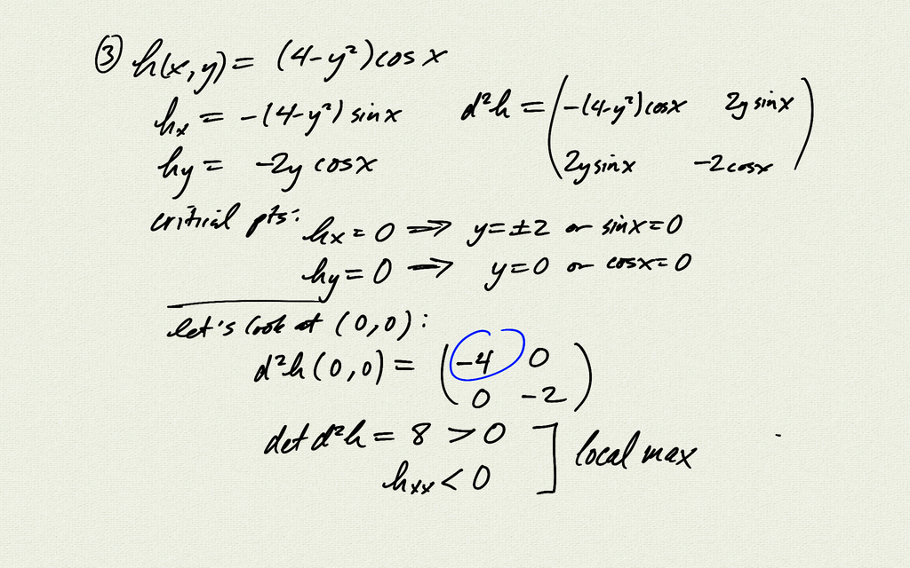
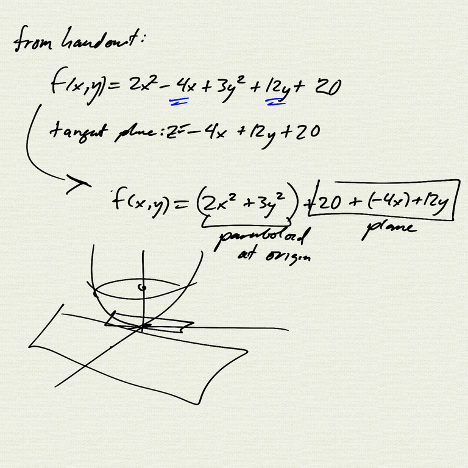

Topics:
- 2nd derivative test
- maxima, minima, saddle points

[notes (pdf)](MultiV_4.2_Optimization.pdf)

<iframe width="560" height="315" src="https://www.youtube.com/embed/9Ts4Hwvvdj0" title="YouTube video player" frameborder="0" allow="accelerometer; autoplay; clipboard-write; encrypted-media; gyroscope; picture-in-picture" allowfullscreen></iframe>

