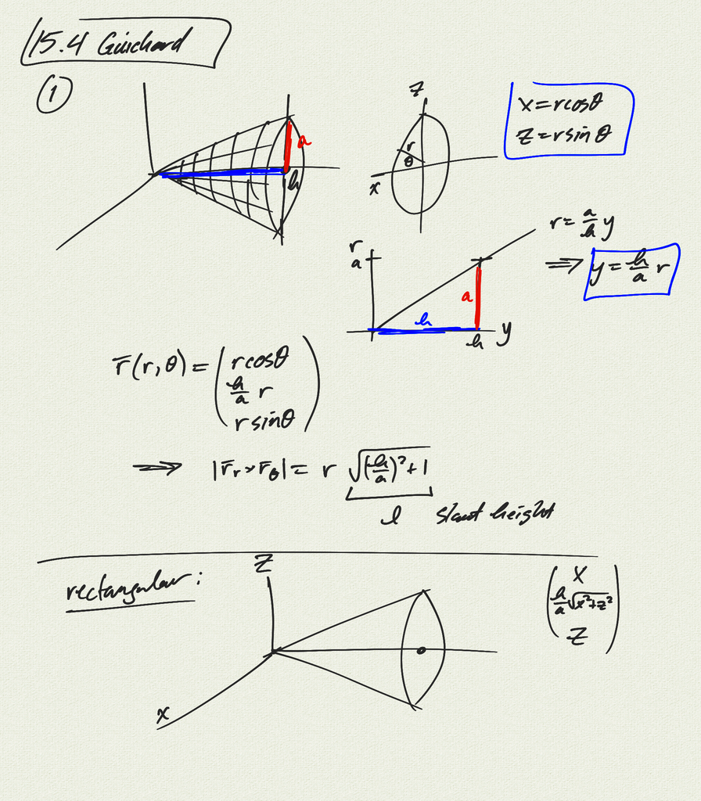
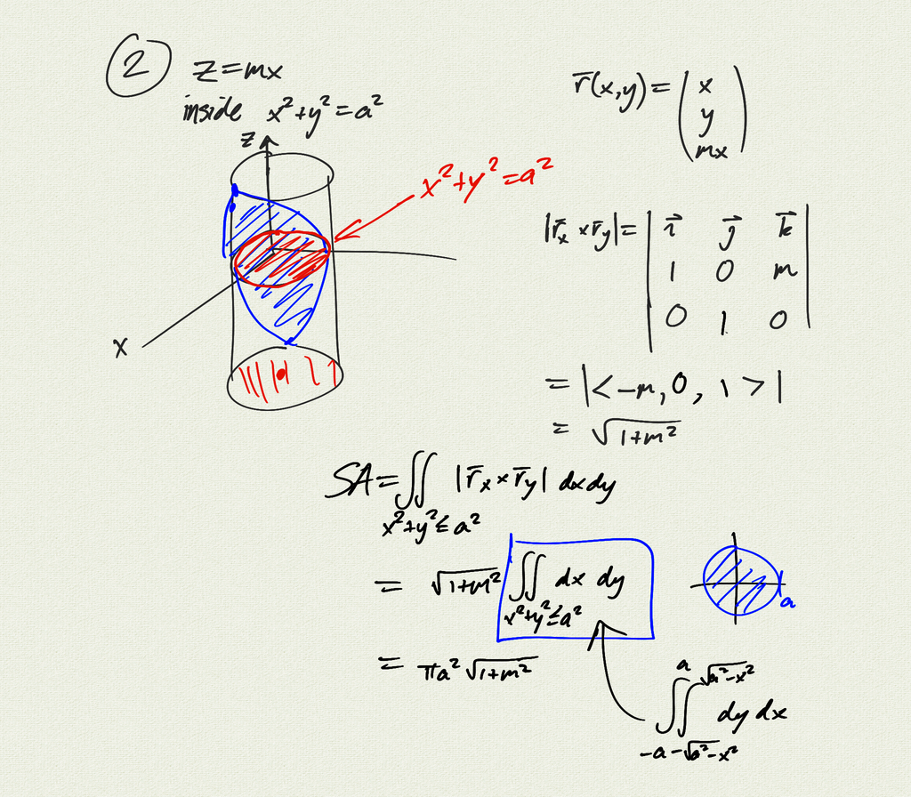
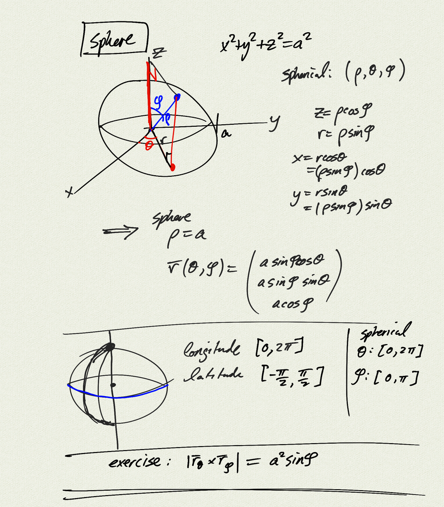
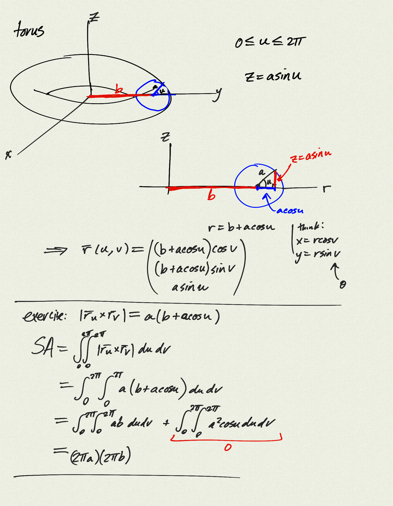
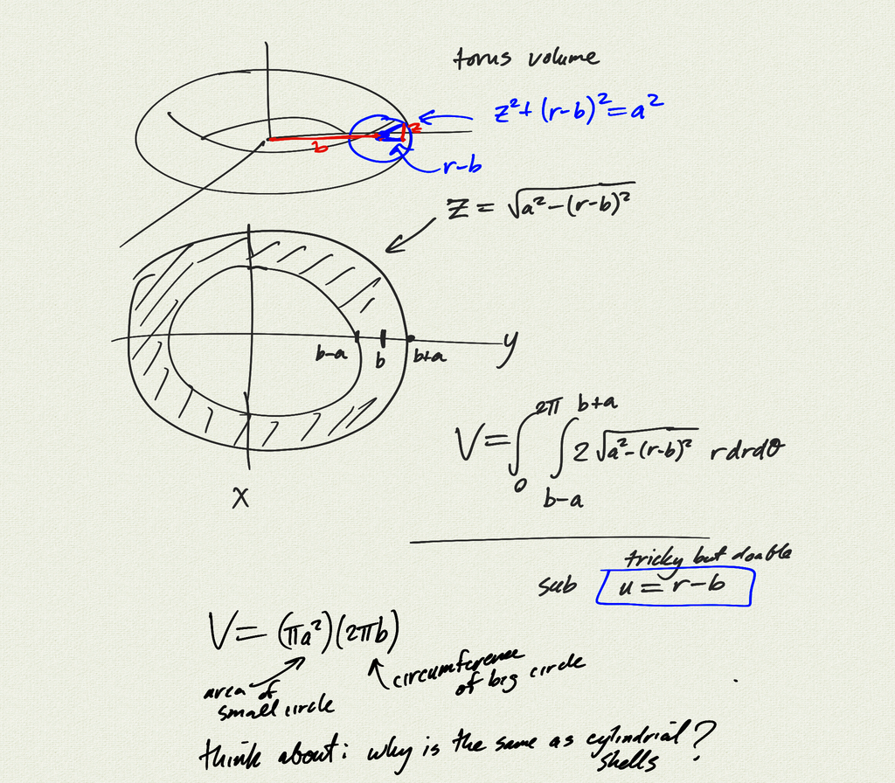

Topics:
- parametrization of sphere
- torus: parametrization, surface area, volume
- donuts

[notes (pdf)](MultiV_5.6_MoreSurfaces.pdf) 

<iframe width="560" height="315" src="https://www.youtube.com/embed/SA5C5eORHfc" title="YouTube video player" frameborder="0" allow="accelerometer; autoplay; clipboard-write; encrypted-media; gyroscope; picture-in-picture" allowfullscreen></iframe>

