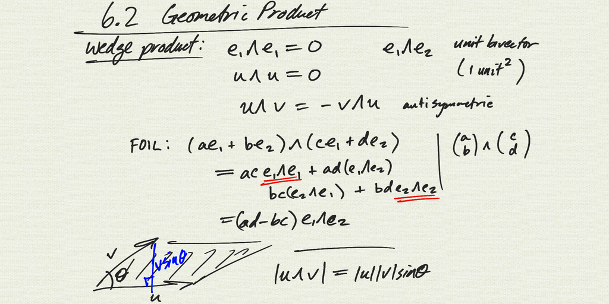

Topics:
- geometric product in $\mathbb{R^2}$:
    $uv = u \cdot v + u \wedge v$

[notes (pdf)](MultiV_6.2_GeometricProduct.pdf) 

<iframe width="560" height="315" src="https://www.youtube.com/embed/culQwrLRRss" title="YouTube video player" frameborder="0" allow="accelerometer; autoplay; clipboard-write; encrypted-media; gyroscope; picture-in-picture" allowfullscreen></iframe>

