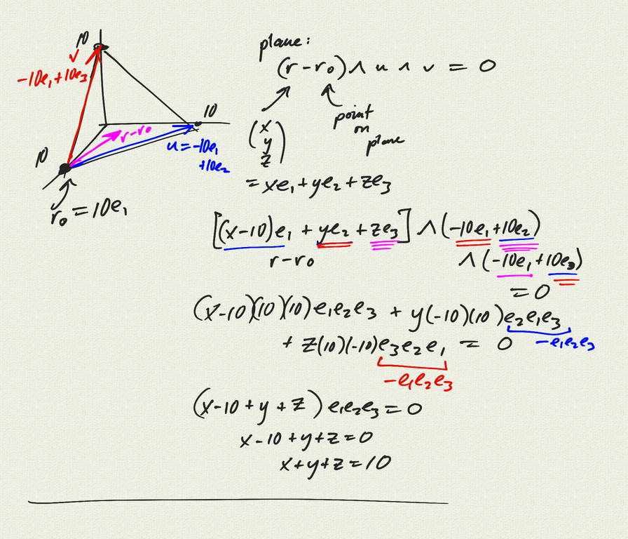
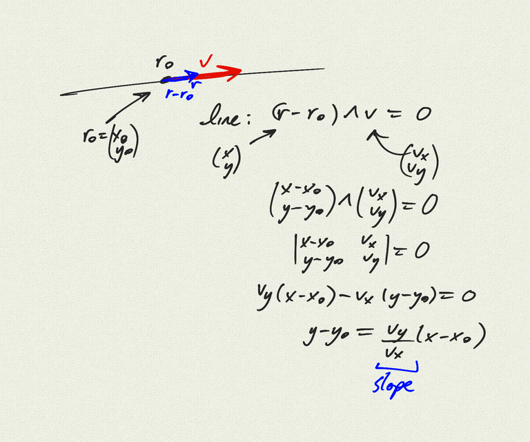
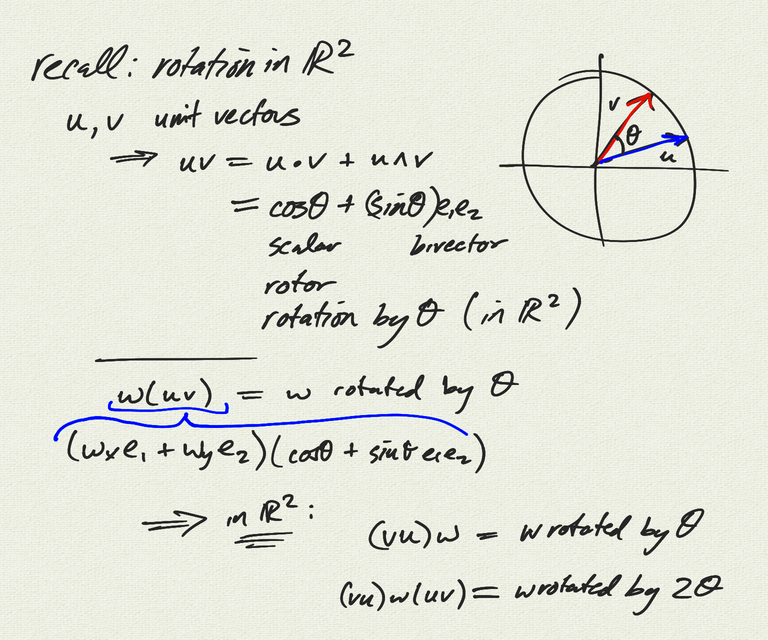
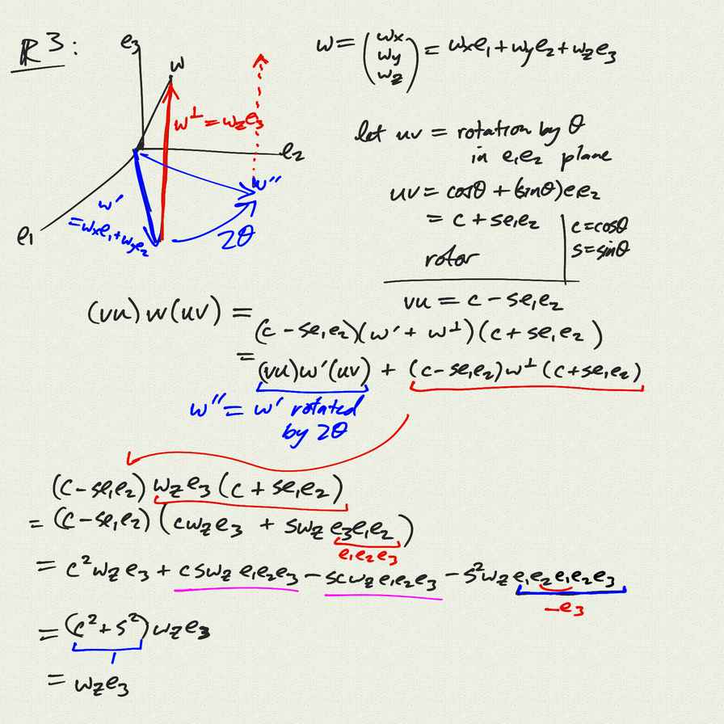
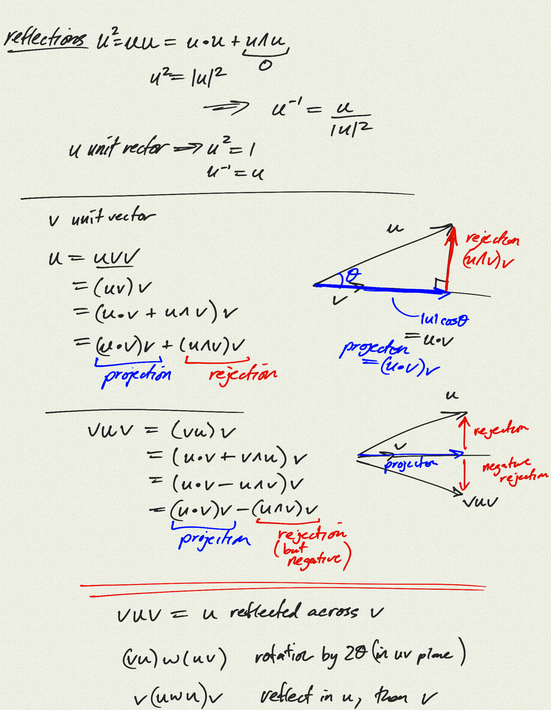
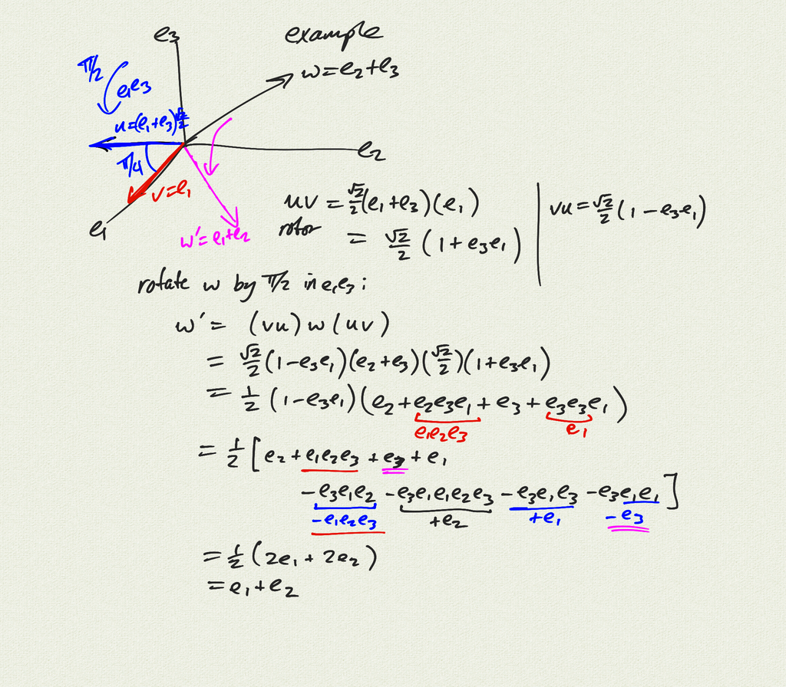

Topics:
- geometric product in $\mathbb{R}^3$
- reflections and rotations

[notes (pdf)](MultiV_6.4_GeometricProduct3D.pdf) 

<iframe width="560" height="315" src="https://www.youtube.com/embed/S33c8dXlnZM" title="YouTube video player" frameborder="0" allow="accelerometer; autoplay; clipboard-write; encrypted-media; gyroscope; picture-in-picture" allowfullscreen></iframe>

