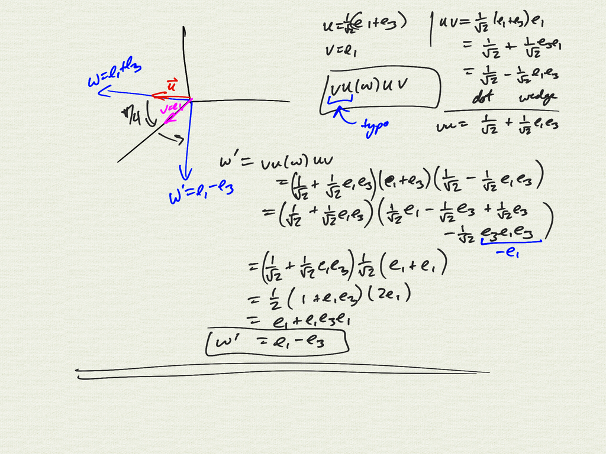
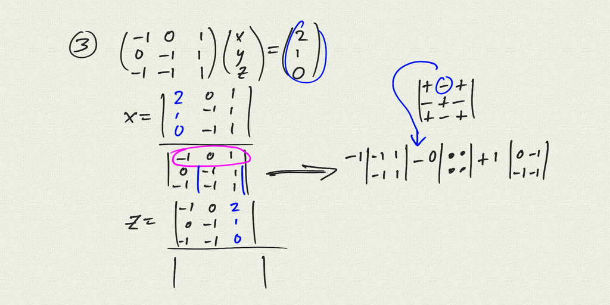
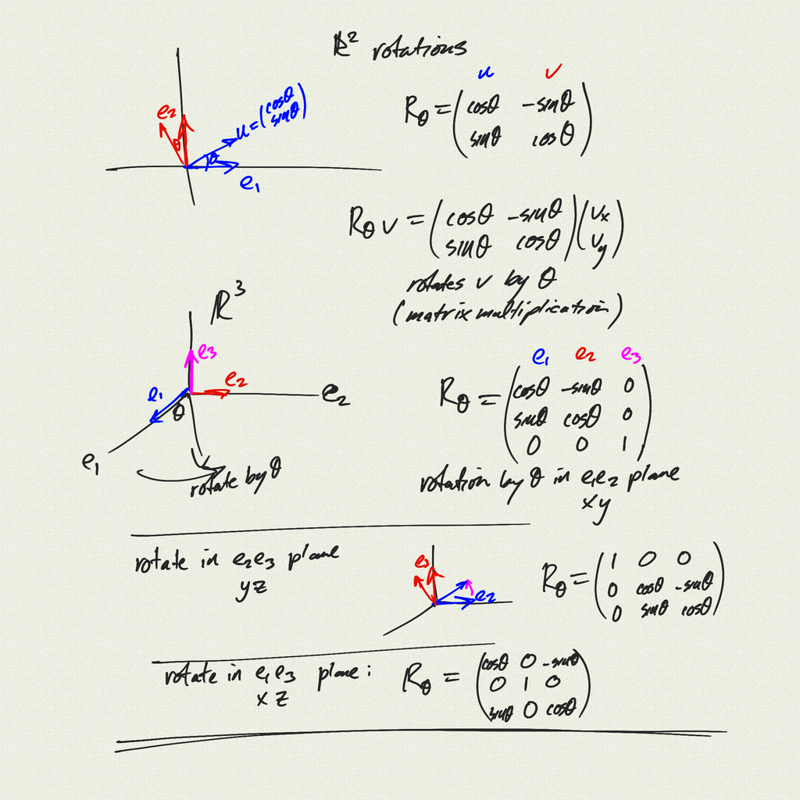
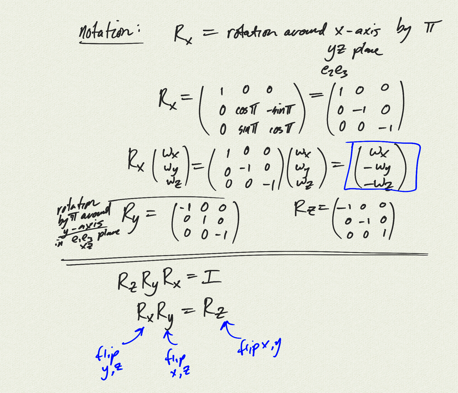
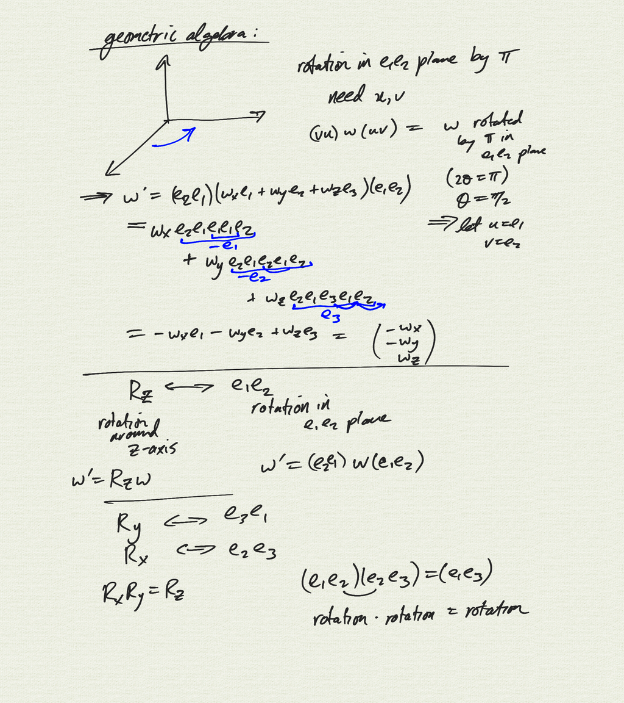

Topics:
- more on composing rotations in 3D

[notes (pdf)](MultiV_6.6_Rotations.pdf) 

<iframe width="560" height="315" src="https://www.youtube.com/embed/oiatT6_Fc8Q" title="YouTube video player" frameborder="0" allow="accelerometer; autoplay; clipboard-write; encrypted-media; gyroscope; picture-in-picture" allowfullscreen></iframe>

