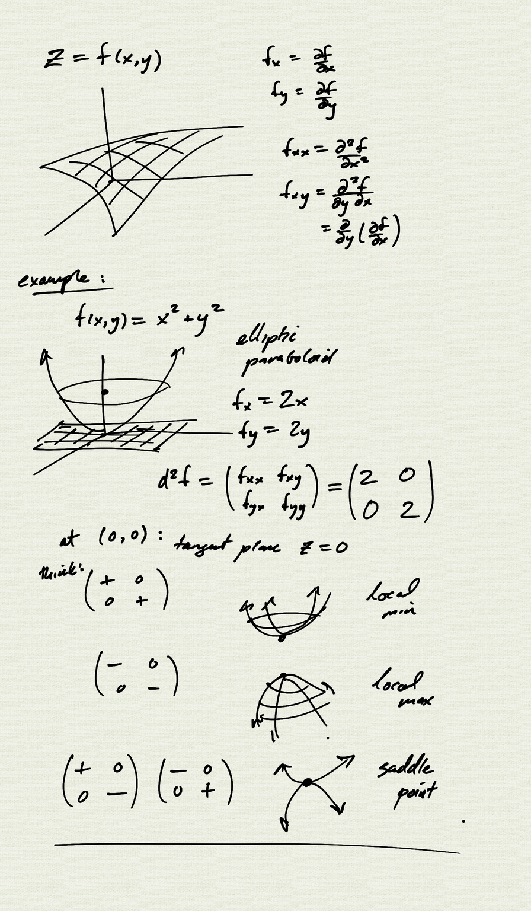
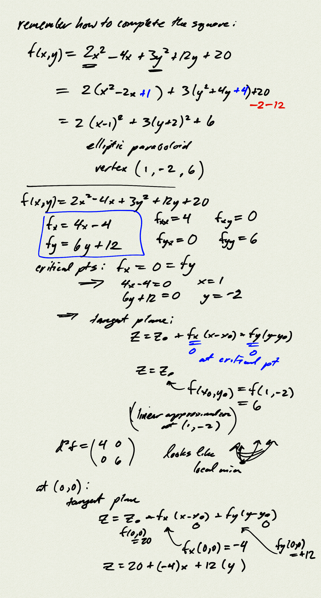

[Unit 4 warmup (html)](multiv_unit4_warmup.html)  
[Unit 4 warmup (pdf)](multiv_unit4_warmup.pdf)  

[Unit 4 group (html)](multiv_unit4_group.html)  
[Unit 4 group (pdf)](multiv_unit4_group.pdf)  

[Unit 4 test (pdf)](multiv_unit4_test.pdf)  
[Unit 4 test key (pdf)](multiv_unit4_test_key.pdf)  

## Warmup notes

[notes](notes/PCHA_Sem2WarmupNotes.pdf)

<iframe width="560" height="315" src="https://www.youtube.com/embed/L0QgCL-DEag" title="YouTube video player" frameborder="0" allow="accelerometer; autoplay; clipboard-write; encrypted-media; gyroscope; picture-in-picture" allowfullscreen></iframe>
