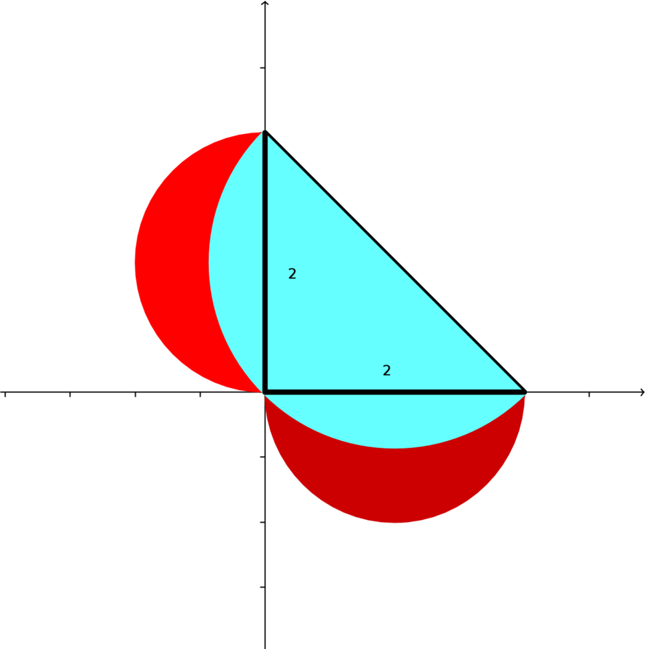

__Unit 5 Classwork (Lunes)__   
__MultiV 2021-22 / Dr. Kessner__    

\vspace{.25in}

\renewcommand{\vec}[1]{\mathbf{#1}}

__1. Lune of Hippocrates__   Pretend you are the Greek mathematician
Hippocrates and show that the area of the lune (red, between the two circular
curves) is the same as the area of the triangle.  Also calculate the area of the
lune using double integration.

[https://en.wikipedia.org/wiki/Lune_of_Hippocrates](https://en.wikipedia.org/wiki/Lune_of_Hippocrates)

\vspace{.25in}

__2. Lunes of Alhazen__  Pretend you are the Arab mathematician Hasan Ibn
al-Haytham (Alhazen) and show that the sum of the areas of the lunes (red,
between circular arcs) is equal to the area of the triangle.  Also calculate
the sum of the areas of the lunes using double integration.

[https://en.wikipedia.org/wiki/Ibn_al-Haytham](https://en.wikipedia.org/wiki/Ibn_al-Haytham)

---
pagetitle: none
math: 
geometry: margin=1in
header-includes: |
    \usepackage{amsmath}
---

