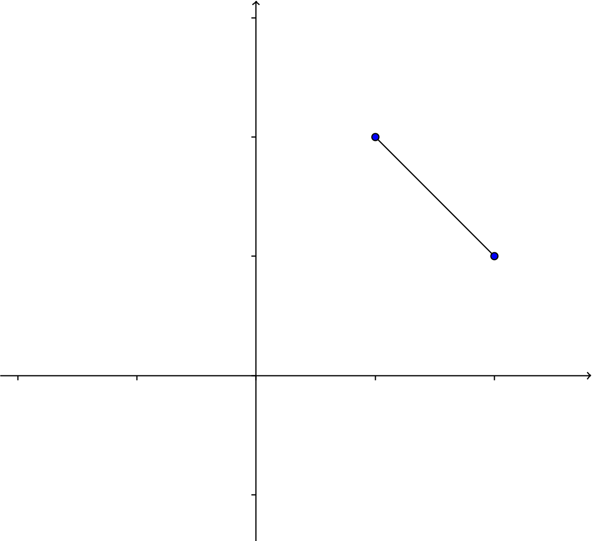
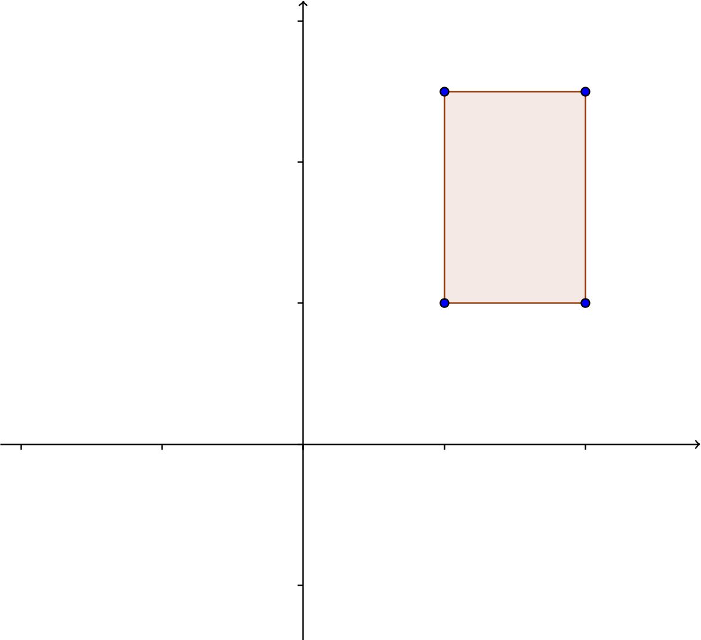

__Unit 5 Test__   
__MultiV 2021-22 / Dr. Kessner__    

\renewcommand{\vec}[1]{\mathbf{#1}}

\vspace{.25in}

This assessment is an opportunity for you to do some mathematical exploration
on your own, using your new multivariable calculus skills.  The most important
thing for you to focus on is the clarity of your exposition.  Draw diagrams,
and be very clear about what your variables mean, how you are parametrizing,
and what you are calculating with your integrals.

You can use any notes or class materials.  You can work with any of your
classmates as long as you have chosen different shapes to analyze.  You can ask
me questions about anything. Have fun!

\vspace{.25in}

__0.__ Choose a curve in the first quadrant of $\mathbb{R}^2$ such that when
you revolve it around the $x$-axis, the 3D shape is _not_ a simple cylinder,
cone, or sphere.  Some examples: a line segment that sweeps out a truncated
cone, a rectangle that sweeps out a cylinder with a hole, a circle that sweeps
out a torus.  You will be analyzing the 3D shape, calculating its surface area
and volume.

{width=200px}
{width=200px}
{width=200px}

Pick a shape where you can verify the surface area and volume with geometric
formulas.  For example, you can find the volume of a truncated cone by
subtracting the volume of one cone from another.

You can use specific real coordinates for your shape, or you can use variables
(e.g. $a$ and $b$ for the radii of the torus).  If you use real numbers, choose
convenient values.

If you start going down a path and things get too ugly, choose an easier path
(i.e. choose different numbers or a different shape).

\vspace{.25in}

__1.__  Find the length and centroid of your curve using integration.  

Now revolve the curve around the $x$-axis and consider the generated surface.
Find the surface area in 4 different ways: 

* use formulas from geometry
* use Pappus' Centroid Theorem 
* compute the surface area of revolution as a single integral
* parametrize the surface in $\mathbb{R}^3$ and compute a double integral

Note that for a curve like the rectangle above, you will have a choice about
how you handle Pappus' Theorem. You could calculate the centroid separately for
each segment, which would let you calculate individual surface areas.  But an
alternative would be to calculate the centroid of the closed curve (using a
piecewise parametrization and integration), which you could use to calculate
the total surface area directly.

\newpage

__2.__  Consider the region enclosed by your curve (or between your curve and
the $x$-axis, i.e. the region that you are about to revolve).  Find the area
and centroid of the region.

Now consider the volume generated by revolving the region around the $x$-axis.
Find the volume of the shape in 4 different ways: 

* use formulas from geometry
* use Pappus' Centroid Theorem
* compute the volume of revolution as a triple integral in
  cylindrical coordinates in two ways (disks and shells).

---
pagetitle: none
math: 
geometry: margin=1in
header-includes: |
    \usepackage{amsmath}
---

