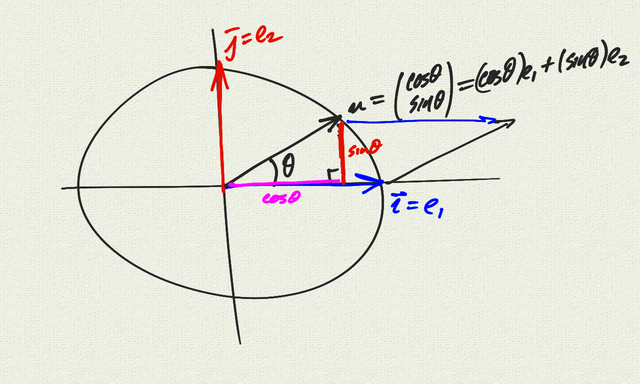
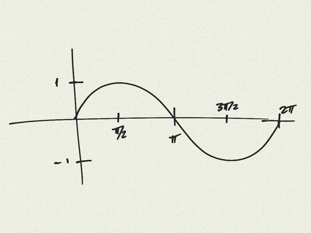
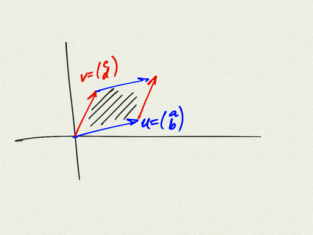
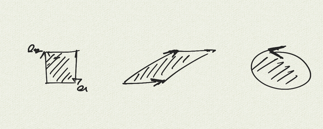
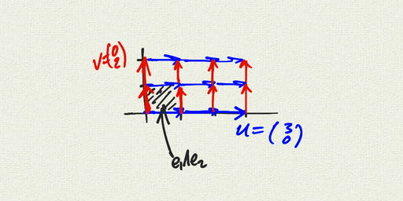
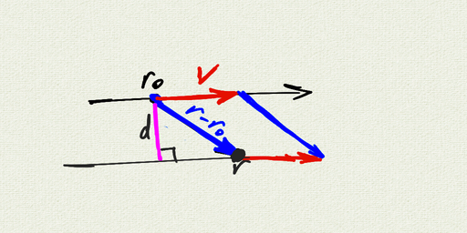

__Geometric Algebra Notes 1 (Wedge Product)__   
__MultiV 2021-22 / Dr. Kessner__    

\vspace{.25in}

\renewcommand{\vec}[1]{\mathbf{#1}}

First we're going to think about the unit circle in
$\mathbb{R^2}$, and change our notation as well.

We're going to call our unit vectors $e_1 = \vec{i} =$

---
pagetitle: none
math: 
geometry: margin=1in
header-includes: |
    \usepackage{amsmath}
---

