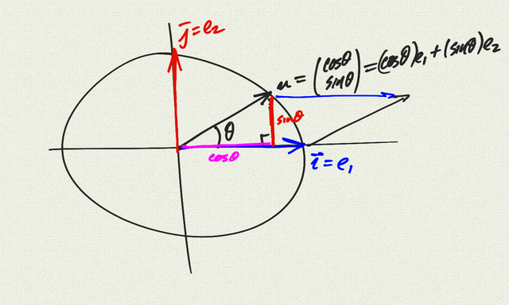
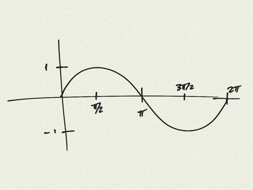
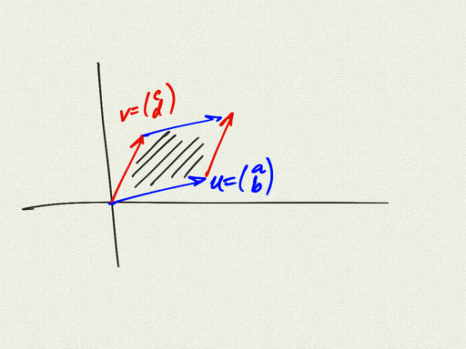
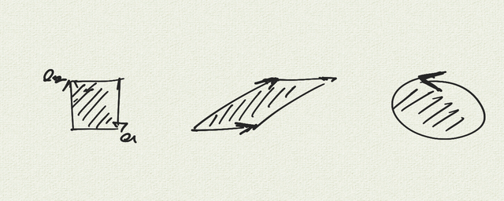
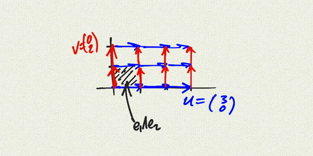
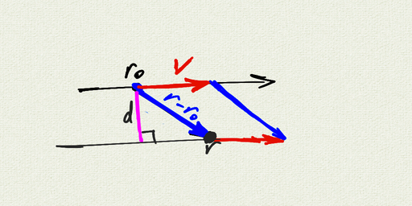

__Geometric Algebra Notes 1 (Wedge Product)__   
__MultiV 2021-22 / Dr. Kessner__    

\vspace{.25in}

\renewcommand{\vec}[1]{\mathbf{#1}}

## The unit circle

First we're going to think about the unit circle in
$\mathbb{R}^2$, and change our notation as well.

We're going to call our unit vectors 
$e_1 = \vec{i} = \begin{pmatrix} 1 \\ 0 \end{pmatrix}$
and 
$e_2 = \vec{j} = \begin{pmatrix} 0 \\ 1 \end{pmatrix}$.

Let $u = \begin{pmatrix} \cos \theta \\ \sin \theta \end{pmatrix}$
be a vector on the unit circle.

Observe that the projection of $u$ on the x-axis is given
by $\cos \theta$, and the area of the parallelogram
determined by $e_1$ and $u$ is $\sin \theta$.

We can graph the area of the parallelogram as $u$ moves around
the unit circle.  Notice that for $\theta \in [\pi, 2\pi]$, 
the area is negative.

\newpage

## The wedge product

We have seen previously that 
$u = \begin{pmatrix} a \\ b \end{pmatrix}$
and 
$v = \begin{pmatrix} c \\ d \end{pmatrix}$,
the area of the parallelogram is given by the determinant
$\begin{vmatrix} 
a & c \\
b & d \\
\end{vmatrix} = ad - bc$.

We define the wedge product $u \wedge v$ to be the directed
(signed) area of the parallelogram determined by the two vectors,
but with "units" (like $\text{meters}^2$).  We call this directed
area a _bivector_.

We define $e1 \wedge e2$ to be the "unit bivector".  It represents
the directed area of the square determined by $e_1$ and $e_2$.  A
general bivector will be a scalar multiple of $e_1 \wedge e_2$.
However, the actual shape of of the bivector is not specified:  we
can think of it as a square, or reshape it to a parallelogram, or
an amorphous shape in the plane.

From the definition of the wedge product, we observe that:  
$e_1 \wedge e_1 = 0 = e_2 \wedge e_2$  
$e_2 \wedge e_1 = - e_1 \wedge e_2$.

The distributive property is not so obvious:  
$w \wedge (u+v) = w\wedge u + w\wedge v$ 

Once we believe the distributive property, we can do FOIL.  
Let
$u = \begin{pmatrix} a \\ b \end{pmatrix} = a e_1 + b e_2$  
and 
$v = \begin{pmatrix} c \\ d \end{pmatrix} = c e_1 + d e_2$.

Then  

$\begin{aligned}
u \wedge v &= (a e_1 + b e_2) \wedge (c e_1 + d e_2) \\
           &= (a e_1 \wedge c e_1) + (a e_1 \wedge d e_2) + (b e_2 \wedge c e_1) + (b e_2 \wedge d e_2) \\
           &= ac (e_1\wedge e_1) +  + ad (e_1 \wedge e_2) + bc (e_2 \wedge e_1) + bd (e_2 \wedge e_2) \\
           &= (ad-bc) (e_1 \wedge e_2)
\end{aligned}$

Notice that the determinant $ad-bc$ emerges as a consequence of
the elementary properties of the wedge product.

Or we can use this as a shortcut for calculating the wedge
product between two vectors:

$\begin{aligned}
u \wedge v &= \begin{pmatrix} a \\ b \end{pmatrix} \wedge 
              \begin{pmatrix} c \\ d \end{pmatrix} \\
           &= \begin{vmatrix} 
              a & c \\
              b & d \\
              \end{vmatrix} (e_1 \wedge e_2) \\
           &= (ad-bc) (e_1 \wedge e_2)
\end{aligned}$

Here's an example:  

$\begin{aligned}
\begin{pmatrix} 3 \\ 0 \end{pmatrix} \wedge 
\begin{pmatrix} 0 \\ 2 \end{pmatrix} &=
           \begin{vmatrix} 
              3 & 0 \\
              0 & 2 \\
              \end{vmatrix} (e_1 \wedge e_2) \\
           &= 6 (e_1 \wedge e_2)
\end{aligned}$

\newpage

## Application: Distance from a point to a line

Here's an application to a problem we have solved with
the dot product and projection / rejection before: calculate
the distance from a point to a line.

Suppose you have a line given by a point $r_0$ and a vector
$v$.  Suppose also that you have a point $r$ in the plane.
To calculuate the distance from the point to the line,
you can find the area of the parallelogram between the
vectors $r-r_0$ and $v$, and divide by the base (the length of $v$).
The height of the parallelogram is the perpendicular distance
from the point to the line:

$d = \dfrac{|(r-r_0)\wedge v|}{|v|}$

Note that you could do this equivalently with the cross product,
but the geometry is not as obvious.  

---
pagetitle: none
math: 
geometry: margin=1in
header-includes: |
    \usepackage{amsmath}
---

